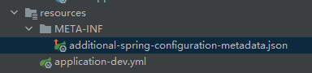

> 后台框架

# SpringFeign在版本2.2.6之前RequestInterceptor不排序问题

原因是FeignClientFactoryBean中没有对RequestInterceptor进行排序

```java
class FeignClientFactoryBean implements FactoryBean<Object>, InitializingBean, ApplicationContextAware {
    // ...
    protected void configureUsingConfiguration(FeignContext context, Feign.Builder builder) {
        // line 124
        Map<String, RequestInterceptor> requestInterceptors = this.getInheritedAwareInstances(context, RequestInterceptor.class);
        if (requestInterceptors != null) {
            List<RequestInterceptor> interceptors = new ArrayList(requestInterceptors.values());
            AnnotationAwareOrderComparator.sort(interceptors);
            builder.requestInterceptors(interceptors);
        }
        // ...
    }
    // ...
}
```


# 源码

## 获取排除自动注入配置

AutoConfigurationImportSelector

```java
protected Set<String> getExclusions(AnnotationMetadata metadata, AnnotationAttributes attributes) {
        Set<String> excluded = new LinkedHashSet();

        excluded.addAll(this.asList(attributes, "exclude"));
        excluded.addAll(Arrays.asList(attributes.getStringArray("excludeName")));
        // 获取配置文件中的排除项
        excluded.addAll(this.getExcludeAutoConfigurationsProperty());
        return excluded;
    }

protected List<String> getExcludeAutoConfigurationsProperty() {
    Environment environment = this.getEnvironment();
    if (environment == null) {
        return Collections.emptyList();
    } else if (environment instanceof ConfigurableEnvironment) {
        Binder binder = Binder.get(environment);
        return (List)binder.bind("spring.autoconfigure.exclude", String[].class).map(Arrays::asList).orElse(Collections.emptyList());
    } else {
        String[] excludes = (String[])environment.getProperty("spring.autoconfigure.exclude", String[].class);
        return excludes != null ? Arrays.asList(excludes) : Collections.emptyList();
    }
}
```


# IDEA配置文件配置不报警告方法

## 配置property类

创建一个类，在类上添加**@Configuration**、**@ConfigurationProperties(prefix = "test")**注解，并写好getter，setter方法，并再Maven窗口使用Package命令

```java
@Configuration
@ConfigurationProperties(prefix = "test")
public class TestProperty {

    private String ccc;

    public String getCcc() {
        return ccc;
    }

    public void setCcc(String ccc) {
        this.ccc = ccc;
    }
}
```

## 在resources/META-INF下创建additional-spring-configuration-metadata.json

 

格式：

```json
{
  "properties": [
    {
      "name": "asd",
      "type": "java.lang.String",
      "description": "Description for asd."
  }
] }
```

# 异常及处理方法

**_org.springframework.beans.factory.BeanCreationException_**

原因：自动注入时，使用的是父类接口，存在多个实现类的情况下出现

解决方案：使用具体的实现类进行注入

# 事物

在方法上添加``@Transactional``可以开启一个事物

在同一个类中不同方法互相调用,如果异常被捕获了,那么不会有方法进行回滚

当分别在不同类中时互相调用,即便异常捕获了,也会导致所有方法都会被回滚

例:

服务A

```java
@Service
public class ServiceA{
    // ...
    
    @Transactional(rollbackFor = Exception.class)
    public void transactionalTest() {
       	// 具体数据库操作....
        // 模拟报错
        int i = 1/ 0;
    }
}
```

服务B

```java
@Service
public class ServiceB{
    private final ServiceA serviceA;
    public ServiceB(ServiceA serviceA){
        this.serviceA = serviceA;
    }
    
    // ...
    
    @Transactional(rollbackFor = Exception.class)
    public void transactionalTest() {
       	// 具体数据库操作....
        
        try{
            serviceA.transactionalTest();
        }catch(Exception e){
            // 具体异常操作
        }
    }
}
```

在服务B中调用服务A中的方法时,服务A报错,即便在服务B中被捕获了,服务A和B都会进行回滚

# 配置启动参数

* 在application.yml 中配置
* Jar包运行,在命令后面添加
  
  > java -jar springboot.jar --spring.profiles.active=dev
* 添加JVM参数
  
  > java -jar springboot.jar -Dspring.profiles.active=dev
* Tomcat war包启动,修改/bin/catalina.bat(Linux下为catalina.sh)
  > @echo off
  >
  > setlocal
  >
  > set "JAVA_OPTS=%JAVA_OPTS% -Dspring.profiles.active=dev"
  >
  > if not ""%1"" == ""run"" goto mainEntry

# Spring Boot 常见配置

```yaml
spring:
  servlet:
    multipart:
      # 最大上传文件大小,默认是1MB
      max-file-size: 1MB
      # 最大请求大小
      max-request-size: 10MB
```

# 自动装配原理

https://www.cnblogs.com/javaguide/p/springboot-auto-config.html

# SpringBean的生命周期

1. 实例化
2. 属性赋值
3. 初始化
4. 销毁

# Spring的三级缓存

Spring的三级缓存是为了解决循环依赖的问题

一级缓存存放已经实例化并完成属性赋值的bean

二级缓存存放已经实例化但还没有完成属性赋值的bean

三级缓存存放bean工厂(beanFactory)

# Spring中的代理

在Spring中,如果如果目标对象实现了接口,那么采用的是JDK动态代理;如果未实现接口,那么采用的是CGLIB代理

CGLIB代理和JDK代理使用方法比较类似,都要使用到类加载器(ClassLoader),接口类型(interface),以及增强方法.两者在实现增强方法上有所区别,JDK动态代理的增强方法需要实现InvocationHandler,并重写invoke方法;而CGLIB则是实现MethodInterceptor,并重写intercept

# 创建一个Spring starter

1. 创建一个Maven项目

2. 引入依赖

```xml
<?xml version="1.0" encoding="UTF-8"?>
<project xmlns="http://maven.apache.org/POM/4.0.0"
         xmlns:xsi="http://www.w3.org/2001/XMLSchema-instance"
         xsi:schemaLocation="http://maven.apache.org/POM/4.0.0 http://maven.apache.org/xsd/maven-4.0.0.xsd">
    <modelVersion>4.0.0</modelVersion>

    <groupId>com.fool</groupId>
    <artifactId>threadpool-spring-boot-starter</artifactId>
    <version>1.0-SNAPSHOT</version>

    <properties>
        <maven.compiler.source>11</maven.compiler.source>
        <maven.compiler.target>11</maven.compiler.target>
    </properties>

    <parent>
        <groupId>org.springframework.boot</groupId>
        <artifactId>spring-boot-starter-parent</artifactId>
        <version>2.3.7.RELEASE</version>
    </parent>

    <dependencies>
        <dependency>
            <groupId>org.springframework.boot</groupId>
            <artifactId>spring-boot-starter</artifactId>
            <version>2.3.7.RELEASE</version>
        </dependency>
    </dependencies>

</project>
```

3. 创建需要自动装配的Configuration类

```java
// 和普通的@Configuration一样
@Configuration
public class ThreadPoolAutoConfiguration {

    @Bean
    // 当前项目中存在ThreadPoolExecutor这个类才进行装配
    @ConditionalOnClass(ThreadPoolExecutor.class)
    public ThreadPoolExecutor customizeThreadPool() {
        return new ThreadPoolExecutor(5, 10, 1, TimeUnit.MINUTES, new LinkedBlockingDeque<>());
    }

}
```

4. 在resources下创建META-INF/spring.factories

```text
# 需要自动装配的类,多个写多行,以 ,\ 结尾
org.springframework.boot.autoconfigure.EnableAutoConfiguration=\
com.fool.ThreadPoolAutoConfiguration
```

# 统一返回结果

- 配置类

  ```java
  @RestControllerAdvice(basePackages="project package ")
  public class ResponseConfig implements ResponseBodyAdvice<Object> {
      @Override
      public boolean supports(MethodParameter returnType, Class<? extends HttpMessageConverter<?>> converterType) {
          HttpServletRequest request = SpringContextUtils.getRequest();
          // 从Http请求中获取请求头
          String headerValue = request.getHeader(HttpHeaderConst.UNIFORM_RESPONSE);
          return !RequestHeaderEnum.NON_UNIFORM_RESPONSE.getValue().equals(headerValue);
      }
  
      @SneakyThrows
      @Override
      public Object beforeBodyWrite(Object body, MethodParameter returnType, MediaType selectedContentType, Class<? extends HttpMessageConverter<?>> selectedConverterType, ServerHttpRequest request, ServerHttpResponse response) {
          // 从http请求中获取在拦截器中预处理时添加的UniformResponse注解(这里是在ResponseInterceptor中添加的)
          // UniformResponse uniformResponseAnn = (UniformResponse) SpringContextUtils.getRequest().getAttribute(ResponseInterceptor.RESPONSE_RESULT);
  
          // Class<? extends Result> resultClass = uniformResponseAnn.templateClass();
          if (body instanceof Result) {
              return body;
          }
  
          Result<Object> result = new DefaultResult<>();
          result.setCode(Result.SUCCESS);
          result.setData(body);
  
          // 设置自定义的HttpMessageConverter之后可以将此处去除
          // 未设置自定义HttpMessageConvertor而去掉这行,会报ClassCastException
          // if (body instanceof String) {
          //     return JSONObject.toJSONString(result);
          // }
  
  
          return result;
      }
  }
  ```
  
- 自定义HttpMessageConverter

  如果不用自定义,那么当方法返回值为String类型时,响应请求头为text/plain,使用后变为application/json

  ```java
  
  /**
   * @author fool
   * @date 2021/12/14 14:22
   */
  @Configuration
  public class BeanConfig {
  
      /**
       * 使用fastjson将所有的返回值都转成json格式,并将默认的Content-Type设置为application/json
       * @return 自定义的HttpMessageConverter
       */
      @Bean
      public HttpMessageConverter<?> fastJsonHttpMessageConverter() {
          FastJsonHttpMessageConverter fastJsonHttpMessageConverter = new FastJsonHttpMessageConverter();
          // 此处获取的是不可修改的list,所以在下面需要重新创建一个list实例
          List<MediaType> supportedMediaTypes = fastJsonHttpMessageConverter.getSupportedMediaTypes();
          // 第三个参数用于排序
          MediaType mediaType = new MediaType("application", "json", 1.0);
  
          ArrayList<MediaType> mediaTypes = new ArrayList<>(supportedMediaTypes);
          mediaTypes.add(mediaType);
  
          fastJsonHttpMessageConverter.setSupportedMediaTypes(Collections.unmodifiableList(mediaTypes));
          return fastJsonHttpMessageConverter;
      }
  
  }
  ```

- 设置优先使用自定义HttpMessageConverter

  ```java
  
  @Configuration
  public class WebMvcConfiguration implements WebMvcConfigurer {
  
      private final HttpMessageConverter<?> httpMessageConverter;
  
      public WebMvcConfiguration( HttpMessageConverter<?> httpMessageConverter) {
          this.httpMessageConverter = httpMessageConverter;
      }
  
  
      @Override
      public void extendMessageConverters(List<HttpMessageConverter<?>> converters) {
          Iterator<HttpMessageConverter<?>> iterator = converters.iterator();
          while (iterator.hasNext()) {
              HttpMessageConverter<?> next = iterator.next();
              if (next == httpMessageConverter) {
                  iterator.remove();
                  break;
              }
          }
  
          converters.add(0, httpMessageConverter);
      }
  
  }
  ```

- 自定义HttpMessageConvertor能改变响应请求头的原因

  通过查看源码发现Http响应最终是使用HttpMessageConvertor的实现类进行转换(AbstractMessageConverterMethodProcessor.writeWithMessageConverters)

  ```java
  // AbstractMessageConverterMethodProcessor Line 271...
  if (body != null) {
  	Object theBody = body;
  	LogFormatUtils.traceDebug(logger, traceOn ->
  			"Writing [" + LogFormatUtils.formatValue(theBody, !traceOn) + "]");
  	addContentDispositionHeader(inputMessage, outputMessage);
  	if (genericConverter != null) {
           // genericConverter是HttpMessageConvertor的一个子类
  		genericConverter.write(body, targetType, selectedMediaType, outputMessage);
  	}
  	else {
  		((HttpMessageConverter) converter).write(body, selectedMediaType, outputMessage);
  	}
  }
  ```

  当接口返回值为String类型时,默认由StringHttpMessageConvertor进行响应.

  为了实现统一的返回结果,需要在ResponseBodyAdvice.beforeBodyWrite中将范围值设置成Result类型.

  但此时使用的仍旧是StringHttpMessageConvertor,所以会报ClassCaseException

  所以需要使用自定义的HttpMessageConvertor,正好FastJson提供了已经编写好的FastJsonHttpMessageConverter

  配置好FastJsonHttpMessageConverter之后,重新调用接口,接口无报错,但是响应头的Content-Type为text/plain

  继续查看源码,发现Content-type由MediaType控制,而MediaType来源于HttpMessageConvertor

  ```java
  // AbstractMessageConverterMethodProcessor类中的方法
  protected List<MediaType> getProducibleMediaTypes(HttpServletRequest request, Class<?> valueClass, @Nullable Type targetType) {
  	Set<MediaType> mediaTypes = (Set<MediaType>) request.getAttribute(HandlerMapping.PRODUCIBLE_MEDIA_TYPES_ATTRIBUTE);
  	if (!CollectionUtils.isEmpty(mediaTypes)) {
  		return new ArrayList<>(mediaTypes);
  	}
  	else if (!this.allSupportedMediaTypes.isEmpty()) {
  		List<MediaType> result = new ArrayList<>();
  		for (HttpMessageConverter<?> converter : this.messageConverters) {
  			if (converter instanceof GenericHttpMessageConverter && targetType != null) {
  				if (((GenericHttpMessageConverter<?>) converter).canWrite(targetType, valueClass, null)) {
                        // 此处获取HttpMessageConvertor
  					result.addAll(converter.getSupportedMediaTypes());
  				}
  			}
  			else if (converter.canWrite(valueClass, null)) {
                    // 此处获取HttpMessageConvertor
  				result.addAll(converter.getSupportedMediaTypes());
  			}
  		}
  		return result;
  	}
  	else {
  		return Collections.singletonList(MediaType.ALL);
  	}
  }
  ```

  并且在获取MediaType数组后,会进行排序,然后使用第一个MediaType

  ```java
  HttpServletRequest request = inputMessage.getServletRequest();
  List<MediaType> acceptableTypes = getAcceptableMediaTypes(request);
  // 将HttpMessageConvertor中的MediaType
  List<MediaType> producibleTypes = getProducibleMediaTypes(request, valueType, targetType);
  if (body != null && producibleTypes.isEmpty()) {
  	throw new HttpMessageNotWritableException(
  			"No converter found for return value of type: " + valueType);
  }
  List<MediaType> mediaTypesToUse = new ArrayList<>();
  
  for (MediaType requestedType : acceptableTypes) {
  	for (MediaType producibleType : producibleTypes) {
  		if (requestedType.isCompatibleWith(producibleType)) {
  			mediaTypesToUse.add(getMostSpecificMediaType(requestedType, producibleType));
  		}
  	}
  }
  if (mediaTypesToUse.isEmpty()) {
  	if (body != null) {
  		throw new HttpMediaTypeNotAcceptableException(producibleTypes);
  	}
  	if (logger.isDebugEnabled()) {
  		logger.debug("No match for " + acceptableTypes + ", supported: " + producibleTypes);
  	}
  	return;
  }
  // 将获取到的MediaType进行排序,并根据条件获取实际的MediaType
  MediaType.sortBySpecificityAndQuality(mediaTypesToUse);
  for (MediaType mediaType : mediaTypesToUse) {
  	if (mediaType.isConcrete()) {
  		selectedMediaType = mediaType;
  		break;
  	}
  	else if (mediaType.isPresentIn(ALL_APPLICATION_MEDIA_TYPES)) {
  		selectedMediaType = MediaType.APPLICATION_OCTET_STREAM;
  		break;
  	}
  }
  ```

  回到BeanConfig,在实例化FastJsonHttpMessageConverter时,添加一个application/json的MediaType,并将用于排序的qualityValue设置为最大1.0(qualityValue范围为0.0 ~ 1.0).由于FastJsonHttpMessageConverter.getSupportedMediaTypes返回的是一个UnmodifiableRandomAccessList(不可修改数组),所以需要将UnmodifiableRandomAccessList转成ArrayList后添加MediaType.最后将包含新建的MediaType的list赋值给FastJsonHttpMessageConverter.

- 访问找不到路径的情况下,仍旧范围200的情况,定义全局异常处理,返回统一的结果类

  ```java
  @Slf4j
  @RestControllerAdvice(basePackages="project package ")
  public class GlobalExceptionHandler {
  
      @ResponseBody
      @ResponseStatus(HttpStatus.INTERNAL_SERVER_ERROR)
      @ExceptionHandler({Exception.class})
      public DefaultResult<Object> handleException(Exception e, HttpServletRequest request) {
  		// 异常处理
          return DefaultResult.error(e.getMessage());
      }
  
      @ResponseBody
      @ExceptionHandler({NoHandlerFoundException.class})
      @ResponseStatus(HttpStatus.NOT_FOUND)
      public ErrorResult<Object> handleNoHandlerFoundException(Exception e, HttpServletRequest request) {
  		// 异常处理
          return  new ErrorResult<>(HttpStatus.NOT_FOUND.value(),HttpStatus.NOT_FOUND.getReasonPhrase(),request.getServletPath());
      }
  
  }
  
  ```

- 修改yml文件

  ```yaml
  spring:
    # 404会抛出错误设置,防止找不到路径http返回码还是200
    mvc:
      throw-exception-if-no-handler-found: true
    # 404会抛出错误设置,防止找不到路径http返回码还是200，如果出现Swagger页面无法访问的时候可以删除此配置
    resources:
      add-mappings: false
  ```

  

## 与Swagger冲突的地方

在将spring.resources.add-mappings 设置为 false 之后,会导致swagger无法访问,需要将GlobalExceptionHandler和ResponseConfig类上的 ControllerAdvice 修改为  @RestControllerAdvice(basePackages="project package")，不过可能会导致404异常无法捕获

# 自定义application.yml中的参数

## maven设置

依赖

```xml

<dependency>
    <groupId>org.springframework.boot</groupId>
    <artifactId>spring-boot-configuration-processor</artifactId>
    <optional>true</optional>
</dependency>
```

plugin

```xml

<plugin>
    <groupId>org.springframework.boot</groupId>
    <artifactId>spring-boot-maven-plugin</artifactId>
    <configuration>
        <excludes>
            <exclude>
                <groupId>org.springframework.boot</groupId>
                <artifactId>spring-boot-configuration-processor</artifactId>
            </exclude>
        </excludes>
    </configuration>
</plugin>
```

# SpEL（Spring Expression Language)

## 自定义使用SpEL

```java
ExpressionParser parser = new SpelExpressionParser();
Expression expression = parser.parseExpression("('Hello' + ' World').concat(#end)");
EvaluationContext context = new StandardEvaluationContext();
context.setVariable("end", "!");
System.out.println(expression.getValue(context,String.class));
```

> context.setVariable方法中key不可以为root

## 使用静态方法

```java
ExpressionParser parser = new SpelExpressionParser();
// 使用Math.random()fa'g
Expression expression = parser.parseExpression("T(java.lang.Math).random()*10");
EvaluationContext context = new StandardEvaluationContext();
context.setVariable("end", "!");
System.out.println(expression.getValue(context,String.class));
```


# Validation

用于入参校验

## 使用方法

实体类上标注具体的规则和校验组（组类别是自定义的Class）

```java
@Data
public class Student{
    
    @NotBlank(groups = StudentValidateGroups.AddStudent.class)
    private String name;
    
    @Range(min = 12, max = 20)
    private Integer age;
}
```

校验组定义,组别仅仅是一个空的接口类

```java
public class StudentValidateGroups{
    public interface AddStudent{
        
    }
    
    public interface UpdateStudent{
        
    }
}
```


controller类方法参数上添加需要校验注解

```java
@RestController
public class StudentController{
    
    // 只校验实体类中groups为StudentValidateGroups.AddStudent.class的属性
    @PostMapping("/student")
    public void add(@Requestbody @Validated(StudentValidateGroups.AddStudent.class) Student student){
        
    }
    
}
```


## 自定义校验规则

新建定义校验逻辑的校验类(需要实现ConstraionValidator)

```java
// 第一个泛型指的是注解的类型，第二个泛型指的是被注解的字段的类型
public class TestValidator implements ConstraionValidator<TestValid,String>{
    
    // 第一个参数是被逐节字段的值，第二个参数是上下文
    @Override
    public boolean isValid(String value,ConstraionValidatorContext context){
        return false;
    }
    
}
```

注解

```java
@Target({ElementType.FIELD})
@Documented
@Retention(RetentionPolicy.RUNTIME)
@Constraint(validateBy = TestValidator.class)
public @interface TestValid{
    String message() default "";
    
    Class<?>[] groups() default {};
    
    Class<? extends Payload>[] payload() default {};
}
```

# SpringRetry


# SpringSecurity

## SpringSecurity校验流程

SpringSecurity是通过一系列的Filter过滤器进行实现的，所有的Filter都保存在SecurityFilterChain中,SecurityFilterChain由ApplicationFilterChain进行管理

首先ApplicationFilterChain会通过保存的ApplicationFilterConfig获取到Filter的代理类，代理类根据请求以及``WebSecurityConfigurerAdapter.class``中的配置获取对应的SecurityFilterChain所管理的Filters，最终通过新键一个虚拟过滤器链（``VirtualFilterChain.class``）进行过滤流程

## Maven依赖

```xml

<dependency>
    <groupId>org.springframework.boot</groupId>
    <artifactId>spring-boot-starter-security</artifactId>
</dependency>
```

## 自定义配置项

YML中的配置

```yaml
jwt:
  issuer: Fool
  tokenHeader: Authorization
  secret: my-springsecurity-plus
  expiration: 604800
```

Java代码

```java

@Data
@Configuration
@ConfigurationProperties(prefix = "jwt")
public class JwtProperty {
    /**
     * 发布者,用于Token生成以及校验
     */
    private String issuer;
    /**
     * request请求中token的请求头名称
     */
    private String tokenHeader;
    /**
     * 生成token所需要的密钥
     */
    private String secret;
    /**
     * token失效时间,单位毫秒
     */
    private Long expiration;
}
```

pom.xml,添加一下依赖可以在写好Java类后更好的配置yml文件(可不添加,无影响),需Maven重新编译打包

```xml

<dependency>
    <groupId>org.springframework.boot</groupId>
    <artifactId>spring-boot-configuration-processor</artifactId>
    <optional>true</optional>
</dependency>
```

## UserDetailService

自定义类实现UserDetailService用于获取用户

```java
public class UserService implements UserDetailsService {
    @Override
    public UserDetails loadUserByUsername(String username) throws UsernameNotFoundException {
        // 使用username从数据库中查询用户
        // 如果密码在存储时没有加密,那么则在取出时进行加密
        String password = "1234";
        // 查询用户的权限
        String[] permissions = new String[]{"ADMIN"};
        return new User(username, password, Stream.of(permissions).map(e -> (GrantedAuthority) () -> e).collect(Collectors.toList()));
    }
}
```

## FilterInvocationSecurityMetadataSource

自定义类实现FilterInvocationSecurityMetadataSource,用于获取当前路径哪些权限可以访问,动态权限控制

```java

@Component
public class CustomizeFilterInvocationSecurityMetadataSource implements FilterInvocationSecurityMetadataSource {
    @Override
    public Collection<ConfigAttribute> getAttributes(Object o) throws IllegalArgumentException {
        //获取请求地址
        String requestUrl = ((FilterInvocation) o).getRequestUrl();
        log.debug("Request url:{}", requestUrl);
        // 查询请求路径所需要的权限
        // 如果想要不登陆也可访问,那么返回空即可.SecurityConfig.createList();
        String[] attributes = {"ADMIN"};
        return SecurityConfig.createList(attributes);
    }

    @Override
    public Collection<ConfigAttribute> getAllConfigAttributes() {
        return null;
    }

    @Override
    public boolean supports(Class<?> aClass) {
        return true;
    }
}
```

## AccessDecisionManager

自定义类实现AccessDecisionManager,用于判断当前用户是否拥有访问当前路径的权限

```java

@Component
public class CustomizeAccessDecisionManager implements AccessDecisionManager {
    @Override
    public void decide(Authentication authentication, Object o, Collection<ConfigAttribute> collection) throws AccessDeniedException, InsufficientAuthenticationException {
        for (ConfigAttribute ca : collection) {
            //当前请求需要的权限,此处路径权限是调用CustomizeFilterInvocationSecurityMetadataSource的getAttributes获取的
            String needRole = ca.getAttribute();
            //当前用户所具有的权限
            Collection<? extends GrantedAuthority> authorities = authentication.getAuthorities();
            for (GrantedAuthority authority : authorities) {
                if (authority.getAuthority().equals(needRole)) {
                    return;
                }
            }
        }
        // 权限不足,抛出访问被拒异常,会被上一级捕获,最终调用自定义AccessDeniedHandler中的handle方法
        throw new AccessDeniedException("权限不足!");
    }

    @Override
    public boolean supports(ConfigAttribute configAttribute) {
        return true;
    }

    @Override
    public boolean supports(Class<?> aClass) {
        return true;
    }

}
```

## OncePerRequestFilter

自定义类继承OncePerRequestFilter,实现Token处理   
用于登陆后返回Token而不是产生一个Session的情况,需要将此过滤器放到UsernamePasswordAuthenticationFilter之前执行

```java

@Component
public class JwtAuthenticationFilter extends OncePerRequestFilter {
    private JwtProperty jwtProperty;

    @Autowired
    public void setJwtProperty(JwtProperty jwtProperty) {
        this.jwtProperty = jwtProperty;
    }

    @Override
    protected void doFilterInternal(HttpServletRequest request, HttpServletResponse response, FilterChain filterChain) throws ServletException, IOException {
        // 获取Token
        String token = request.getHeader(jwtProperty.getTokenHeader());

        UsernamePasswordAuthenticationToken authentication = null;

        try {
            Algorithm algorithm = Algorithm.HMAC256(jwtProperty.getSecret());
            JWTVerifier verifier = JWT.require(algorithm).withIssuer(jwtProperty.getIssuer()).build();
            // 验证Token是否有效,无效会报错
            DecodedJWT verify = verifier.verify(token);
            // 从token中获取用户名称,和权限
            String username = verify.getClaim("username").asString();
            String[] roles = verify.getClaim("roles").asArray(String.class);

            List<GrantedAuthority> permissions = Stream.of(roles).map(e -> (GrantedAuthority) () -> e).collect(Collectors.toList());
            User user = new User(username, "PROTECTED", permissions);
            // 生成一个authentication,
            authentication = new UsernamePasswordAuthenticationToken(user, null, permissions);
            authentication.setDetails(new WebAuthenticationDetailsSource().buildDetails(request));
            logger.info(String.format("Authenticated user %s, setting security context", username));
        } catch (JWTVerificationException e) {
            logger.warn(String.format("Verify token failed:%s", token), e);
        } catch (Exception e) {
            logger.error(String.format("Parsing token failed:%s", token), e);
        }
        /*
            将authentication放到上下文中,
            因为在WebSecurityConfig中取消了session,所以无论是否调用过登录接口,上下文中都不会存在authentication
            需要在判断是否登录前从Token中获取用户信息,生成authentication,手动放入上下文
         */
        SecurityContextHolder.getContext().setAuthentication(authentication);
        // 执行下一个过滤器
        filterChain.doFilter(request, response);
    }
}
```

## 配置SpringSecurity

```java

@Configuration
public class WebSecurityConfig extends WebSecurityConfigurerAdapter {

    private UserService userService;

    private JwtProperty jwtProperty;

    private JwtAuthenticationFilter jwtAuthenticationFilter;

    private CustomizeAccessDecisionManager accessDecisionManager;

    private CustomizeFilterInvocationSecurityMetadataSource securityMetadataSource;

    @Autowired
    public void setJwtAuthenticationFilter(JwtAuthenticationFilter jwtAuthenticationFilter) {
        this.jwtAuthenticationFilter = jwtAuthenticationFilter;
    }

    @Autowired
    public void setJwtProperty(JwtProperty jwtProperty) {
        this.jwtProperty = jwtProperty;
    }

    @Autowired
    public void setAccessDecisionManager(CustomizeAccessDecisionManager accessDecisionManager) {
        this.accessDecisionManager = accessDecisionManager;
    }

    @Autowired
    public void setSecurityMetadataSource(CustomizeFilterInvocationSecurityMetadataSource securityMetadataSource) {
        this.securityMetadataSource = securityMetadataSource;
    }


    @Autowired
    public void setUserService(UserService userService) {
        this.userService = userService;
    }

    /**
     * 将security中加密方式注入到spring容器中
     */
    @Bean
    public PasswordEncoder passwordEncoder() {
        return new BCryptPasswordEncoder();
    }

    /**
     * 将账号密码设置在数据库当中
     */
    @Override
    public void configure(AuthenticationManagerBuilder auth) throws Exception {
        auth
                //将UserDetailsService放到容器中
                .userDetailsService(userService)
                //加密方式放入
                .passwordEncoder(passwordEncoder());
    }


    @Override
    protected void configure(HttpSecurity http) throws Exception {
        // super.configure(http);

        http.cors().and().csrf().disable();
        http.authorizeRequests()
                .withObjectPostProcessor(new ObjectPostProcessor<FilterSecurityInterceptor>() {
                    @Override
                    public <O extends FilterSecurityInterceptor> O postProcess(O o) {
                        //决策管理器
                        o.setAccessDecisionManager(accessDecisionManager);
                        //安全元数据源
                        o.setSecurityMetadataSource(securityMetadataSource);
                        return o;
                    }
                })
                .and()
                //登出
                .logout()
                //允许所有用户
                .permitAll()
                //登出成功处理逻辑
                .logoutSuccessHandler(logoutSuccessHandler())
                //登出之后删除cookie
                .deleteCookies("JSESSIONID")
                //登入
                .and().formLogin()
                //允许所有用户
                .permitAll()
                //登录成功处理逻辑
                .successHandler(authenticationSuccessHandler())
                //登录失败处理逻辑
                .failureHandler(authenticationFailureHandler())
                //异常处理(权限拒绝、登录失效等)
                .and().exceptionHandling()
                //权限拒绝处理逻辑
                .accessDeniedHandler(accessDeniedHandler())
                //匿名用户访问无权限资源时的异常处理
                .authenticationEntryPoint(authenticationEntryPoint())
                //会话管理
                .and()
                // 取消Session,使用JWT
                .sessionManagement().sessionCreationPolicy(SessionCreationPolicy.STATELESS);
        // .sessionManagement()
        //同一账号同时登录最大用户数
        // .maximumSessions(1)
        //会话失效(账号被挤下线)处理逻辑
        // .expiredSessionStrategy(sessionInformationExpiredStrategy());
        // 将自定义的Token处理过滤器添加到UsernamePasswordAuthenticationFilter之前
        http.addFilterBefore(jwtAuthenticationFilter, UsernamePasswordAuthenticationFilter.class);
    }


    /**
     * Session失效调用
     */
    @Bean
    public SessionInformationExpiredStrategy sessionInformationExpiredStrategy() {
        return sessionInformationExpiredEvent -> {
            DefaultResult<Object> result = DefaultResult.beOffline();
            HttpServletResponse httpServletResponse = sessionInformationExpiredEvent.getResponse();
            httpServletResponse.setContentType("text/json;charset=utf-8");
            httpServletResponse.getWriter().write(JSON.toJSONString(result));
        };
    }

    /**
     * 访问被拒
     */
    @Bean
    public AccessDeniedHandler accessDeniedHandler() {
        return (httpServletRequest, httpServletResponse, e) -> {
            DefaultResult<?> result = DefaultResult.accessDenied();
            httpServletResponse.setContentType("text/json;charset=utf-8");
            httpServletResponse.getWriter().write(JSON.toJSONString(result));

        };
    }

    /**
     * 未登录
     */
    @Bean
    public AuthenticationEntryPoint authenticationEntryPoint() {
        return (httpServletRequest, httpServletResponse, e) -> {
            DefaultResult<?> result = DefaultResult.notLoggedIn();
            httpServletResponse.setContentType("text/json;charset=utf-8");
            httpServletResponse.getWriter().write(JSON.toJSONString(result));
        };
    }


    /**
     * 登录成功
     */
    @Bean
    public AuthenticationSuccessHandler authenticationSuccessHandler() {
        return (httpServletRequest, httpServletResponse, authentication) -> {
            UserDetails userDetails = (UserDetails) authentication.getPrincipal();

            long current = System.currentTimeMillis();

            String token = JWT.create().withIssuer(jwtProperty.getIssuer())
                    .withIssuedAt(new Date(current))
                    .withExpiresAt(new Date(current + jwtProperty.getExpiration()))
                    .withClaim("username", userDetails.getUsername())
                    .withArrayClaim("roles", userDetails.getAuthorities().stream().map(GrantedAuthority::getAuthority).collect(Collectors.toList()).toArray(new String[]{}))
                    .sign(Algorithm.HMAC256(jwtProperty.getSecret()));
            DefaultResult<Object> result = DefaultResult.success("登陆成功", token);
            httpServletResponse.setContentType("text/json;charset=utf-8");
            httpServletResponse.getWriter().write(JSON.toJSONString(result));
        };
    }

    /**
     * 登录失败
     */
    @Bean
    public AuthenticationFailureHandler authenticationFailureHandler() {
        return (httpServletRequest, httpServletResponse, e) -> {
            DefaultResult<Object> result = DefaultResult.authFailed(e.getMessage());
            httpServletResponse.setContentType("text/json;charset=utf-8");
            httpServletResponse.getWriter().write(JSON.toJSONString(result));
        };
    }

    /**
     * 登出
     */
    @Bean
    public LogoutSuccessHandler logoutSuccessHandler() {
        return (httpServletRequest, httpServletResponse, authentication) -> {
            DefaultResult<Object> result = DefaultResult.success("登出成功");
            httpServletResponse.setContentType("text/json;charset=utf-8");
            httpServletResponse.getWriter().write(JSON.toJSONString(result));
        };
    }

}
```

# 国际化I8n

## 获取所有国际化信息

```java


```

# 定时任务

## ThreadPoolTaskScheduler

配置

```java
@Bean
public ThreadPoolTaskScheduler threadPoolTaskScheduler(){
    ThreadPoolTaskScheduler threadPoolTaskScheduler = new ThreadPoolTaskScheduler();
    // 设置定时任务线程池核心线程数
    threadPoolTaskScheduler.setPoolSize(2);
    // 设置定时r
    threadPoolTaskScheduler.setThreadFactory(new NamedThreadFactory("邮件发送失败处理"));
    return threadPoolTaskScheduler;
}
```

# 集成


## 集成RabbitMQ

### 依赖

```xml
<dependency>
    <groupId>org.springframework.boot</groupId>
    <artifactId>spring-boot-starter-amqp</artifactId>
</dependency>
```

### 说明

在``springboot``中，交换机、队列和绑定关系可以通过配置或注解来自动在``rabbitmq``中创建，如果rabbitmq中已经存在交换机等，可以不进行配置，直接发送或接收消息

注解创建

```java
@RabbitListener(bindings = {@QueueBinding(
    value = @Queue(name = "demo.ann.test", autoDelete = "false", durable = "true"),
    exchange = @Exchange(name = "topic.demo.ann",type = ExchangeTypes.TOPIC),
    key = "demo.ann.*"
)})
public void annCreateTest(Message message) {
    System.out.println(message);
}
```

此处会在``rabbitmq``中自动创建名为`topic.demo.ann`的交换机，名为`demo.ann.test`的队列，并将队列绑定到交换机上，交换机接收到key为`demo.ann.*`的消息时，会转发到队列中

#### 一对多问题

rabbitmq的队列中的消息只会被成功消费一次，如果多个消费者绑定一个队列，那么会通过负载均衡路由到某一个消费者上

如果要实现发送一条消息，所有订阅者都收到消息，需要将每个订阅者都绑定不同的队列，然后队列再绑定同一个交换机，从而实现广播模式

### Work模式

#### 配置

```java
@Configuration
public class RabbitMQConfig {

    public static final String DATA_QUEUE = "data-queue";

	/**
	 * 定义队列
	 **/
    @Bean(DATA_QUEUE)
    public Queue dataQueue() {
        return new Queue(DATA_QUEUE);
    }
}
```

#### 生产者代码

```java

@Service
public class RabbitMQService {
    private final RabbitTemplate rabbitTemplate;

    public RabbitMQService(@Qualifier("rabbitTemplate") RabbitTemplate rabbitTemplate) {
        this.rabbitTemplate = rabbitTemplate;
    }

    public void placeOrder(Order order) {
        // 此处发送消息,使用的队列名称
        rabbitTemplate.convertAndSend(RabbitMQConfig.DATA_QUEUE, order);
    }
}

```

#### 消费者代码

由spring控制的类中,在方法上添加``@RabbitListener``就可以接受到对应队列的消息

在手动确认机制下,需要通过``Channel``来确认消息是否被消费成功

```java

@Component
@Slf4j
public class RabbitMQListener {

    private final OrderService orderService;

    public RabbitMQListener(OrderService orderService) {
        this.orderService = orderService;
    }

    @RabbitListener(queues = RabbitMQConfig.DATA_QUEUE)
    public void receiverOrder(String msg, Channel channel, Message message) throws IOException {
        log.info("receive msg:{}", msg);
        commonHandler(msg, channel, message);
    }

    public void commonHandler(String msg, Channel channel, Message message) throws IOException {
        long deliveryTag = message.getMessageProperties().getDeliveryTag();
        try {
            Order order = JSONObject.parseObject(msg).toJavaObject(Order.class);
            orderService.add(order);
            // 第二个参数代表的是是否批量确认消费,即将deliveryTag小于当前deliveryTag的消息全部确认消费掉
            channel.basicAck(deliveryTag, false);
        } catch (Exception e) {
            log.error("消费失败", e);
            // 第二参数代表的是是否重新入队
            channel.basicReject(deliveryTag, true);
        }
    }
}

```

### Fanout模式(发布订阅模式)

#### 配置

此处创建了2个队列，一个交换机，并将两个队列都绑定在了交换机上

此处注意,BindingBuilder.bind(queue).to(exchange),如果是Fanout模式,exchange必须是FanoutExchange,否则会变成配置Topic模式发送消息

```java
@Configuration
public class RabbitMQConfig {

    public static final String FANOUT_QUEUE_ONE = "fanout-queue-1";

    public static final String FANOUT_QUEUE_TWO = "fanout-queue-2";

    public static final String FANOUT_EXCHANGE = "fanout-exchange";

    @Bean(FANOUT_QUEUE_ONE)
    public Queue fanoutQueueOne() {
        return new Queue(FANOUT_QUEUE_ONE);
    }

    @Bean(FANOUT_QUEUE_TWO)
    public Queue fanoutQueueTwo() {
        return new Queue(FANOUT_QUEUE_TWO);
    }

    @Bean(FANOUT_EXCHANGE)
    public FanoutExchange exchange() {
        return new FanoutExchange(FANOUT_EXCHANGE);
    }

    @Bean
    public Binding binding1(@Qualifier(FANOUT_QUEUE_ONE) Queue queue, @Qualifier(FANOUT_EXCHANGE) FanoutExchange fanoutExchange) {
        return BindingBuilder.bind(queue).to(fanoutExchange);
    }

    @Bean
    Binding binding2(@Qualifier(FANOUT_QUEUE_TWO) Queue queue, @Qualifier(FANOUT_EXCHANGE) FanoutExchange fanoutExchange) {
        return BindingBuilder.bind(queue).to(fanoutExchange);
    }
}

```

#### 生产者代码

```java
@Service
public class RabbitMQService {


    private final RabbitTemplate rabbitTemplate;

    public RabbitMQService(@Qualifier("rabbitTemplate") RabbitTemplate rabbitTemplate) {
        this.rabbitTemplate = rabbitTemplate;
    }

    public void placeOrder(Order order) {
        rabbitTemplate.convertAndSend(RabbitMQConfig.DATA_QUEUE, order);
    }


    public void fanoutModeTest(Order order) {
        // 此处发送消息,需要填写exchange名称,以及路由key(route key),因为是fanout模式,所以是空字符串即可
        rabbitTemplate.convertAndSend(RabbitMQConfig.FANOUT_EXCHANGE, "", order);
    }

}
```

#### 消费者代码

```java
@Component
@Slf4j
public class RabbitMQListener {

    private final OrderService orderService;

    public RabbitMQListener(OrderService orderService) {
        this.orderService = orderService;
    }

    @RabbitListener(queues = RabbitMQConfig.FANOUT_QUEUE_ONE)
    public void fanoutTest1(String msg, Channel channel, Message message) throws IOException {
        log.info("fanout test 1. receive msg:{}", msg);
        commonHandler(msg, channel, message);
    }

    @RabbitListener(queues = RabbitMQConfig.FANOUT_QUEUE_TWO)
    public void fanoutTest2(String msg, Channel channel, Message message) throws IOException {
        log.info("fanout test 2. receive msg:{}", msg);
        commonHandler(msg, channel, message);
    }

    public void commonHandler(String msg, Channel channel, Message message) throws IOException {
        long deliveryTag = message.getMessageProperties().getDeliveryTag();
        try {
            Order order = JSONObject.parseObject(msg).toJavaObject(Order.class);
            orderService.add(order);
            // 第二个参数代表的是是否批量确认消费,即将deliveryTag小于当前deliveryTag的消息全部确认消费掉
            channel.basicAck(deliveryTag, false);
        } catch (Exception e) {
            log.error("消费失败", e);
            // 第二参数代表的是是否重新入队
            channel.basicReject(deliveryTag, true);
        }
    }
}
```

### Topic模式

#### 配置

相比于Fanout模式(订阅/发布模式),topic多了一个路由(route key),需要在绑定时添加上route key

> 路由中 * 代表的是一个单词, # 代表 0个,1个或多个单词,是单词,非字母,使用点代表单词间的分隔
>
> eg. route key: **fool.***  , fool.one 、fool.two 会路由到此路由当中, fool , fool.one.two 则不会被路由过来
>
> route key:**fool.#** , fool 、fool.one 、fool.one.two 都会路由过来发送消息

```java
@Configuration
public class RabbitMQConfig {

    public static final String TOPIC_QUEUE_ASTERISK = "topic.asterisk";

    public static final String TOPIC_QUEUE_WELL = "topic.well";

    public static final String TOPIC_EXCHANGE = "topic.exchange";

    public static final String ROUTE_KEY_FOOL_ASTERISK = "fool.*";

    public static final String ROUTE_KEY_FOOL_WELL = "fool.#";

    @Bean(TOPIC_QUEUE_ASTERISK)
    public Queue topicQueueAsterisk() {
        return new Queue(TOPIC_QUEUE_ASTERISK);
    }

    @Bean(TOPIC_QUEUE_WELL)
    public Queue topicQueueWell() {
        return new Queue(TOPIC_QUEUE_WELL);
    }

    @Bean(TOPIC_EXCHANGE)
    public TopicExchange topicExchange() {
        return new TopicExchange(TOPIC_EXCHANGE);
    }

    /**
     * topic 模式, 星号路由
     *
     * @param queue         队列
     * @param topicExchange 交换机
     * @return 绑定关系
     */
    @Bean
    public Binding topicBindingAsterisk(@Qualifier(TOPIC_QUEUE_ASTERISK) Queue queue, @Qualifier(TOPIC_EXCHANGE) TopicExchange topicExchange) {
        return BindingBuilder.bind(queue).to(topicExchange).with(ROUTE_KEY_FOOL_ASTERISK);
    }

    /**
     * topic 模式, 井号路由
     *
     * @param queue         队列
     * @param topicExchange 交换机
     * @return 绑定关系
     */
    @Bean
    Binding topicBindingWell(@Qualifier(TOPIC_QUEUE_WELL) Queue queue, @Qualifier(TOPIC_EXCHANGE) TopicExchange topicExchange) {
        return BindingBuilder.bind(queue).to(topicExchange).with(ROUTE_KEY_FOOL_WELL);
    }

}
```

#### 生产者代码

```java
@Service
public class RabbitMQService {

    private final RabbitTemplate rabbitTemplate;

    public RabbitMQService(@Qualifier("rabbitTemplate") RabbitTemplate rabbitTemplate) {
        this.rabbitTemplate = rabbitTemplate;
    }

    public void topicModeTest(){
        rabbitTemplate.convertAndSend(RabbitMQConfig.TOPIC_EXCHANGE,"fool.asterisk","single word test");
        rabbitTemplate.convertAndSend(RabbitMQConfig.TOPIC_EXCHANGE,"fool","none word test");
        rabbitTemplate.convertAndSend(RabbitMQConfig.TOPIC_EXCHANGE,"fool.well.test","multipart word test");
    }

}
```

#### 消费者代码

配置,消费者配置与其他模式一致

```java
@Component
@Slf4j
public class RabbitMQListener {

    @RabbitListener(queues = RabbitMQConfig.TOPIC_QUEUE_ASTERISK)
    public void topicAsterisk(String msg, Channel channel, Message message) throws IOException {
        long deliveryTag = message.getMessageProperties().getDeliveryTag();
        try {
            log.info("topic asterisk test:{}", msg);
            channel.basicAck(deliveryTag, false);
        } catch (Exception e) {
            log.error("消费失败", e);
            channel.basicReject(deliveryTag, true);
        }
    }


    @RabbitListener(queues = RabbitMQConfig.TOPIC_QUEUE_WELL)
    public void topicWell(String msg, Channel channel, Message message) throws IOException {
        long deliveryTag = message.getMessageProperties().getDeliveryTag();
        try {
            log.info("topic well test:{}", msg);
            channel.basicAck(deliveryTag, false);
        } catch (Exception e) {
            log.error("消费失败", e);
            channel.basicReject(deliveryTag, true);
        }
    }

}
```

### 死信队列

死信队列是存储其他队列丢弃或者超时数据的队列,业务队列通过设置超时时间以及死信交换机来将过期以及被拒绝的消息存入到死信队列中

配置

```java
@Configuration
public class RabbitMQConfig {
    public static final String DIRECT_EXCHANGE = "direct-exchange";

    public static final String TIMEOUT_DEAD_LETTER_QUEUE = "timeout-dead-letter-queue";

    public static final String REJECT_DEAD_LETTER_QUEUE = "dead-letter-queue";

    public static final String TIMEOUT_DEAD_LETTER_ROUTE_KEY = "timeout-dead-letter-route-key";

    public static final String REJECT_DEAD_LETTER_ROUTE_KEY = "reject-dead-letter-route-key";

    public static final String DEAD_LETTER_FANOUT_EXCHANGE = "dead-letter-fanout-exchange";

    public static final String FANOUT_TIMEOUT_QUEUE = "fanout-timeout-queue";

    public static final String FANOUT_REJECT_QUEUE = "fanout-reject-queue";

    private static final String QUEUE_ARG_MESSAGE_TTL = "x-message-ttl";

    private static final String QUEUE_ARG_DEAD_LETTER_EXCHANGE = "x-dead-letter-exchange";

    private static final String QUEUE_ARG_DEAD_LETTER_ROUTING_KEY = "x-dead-letter-routing-key";

    @Bean(TIMEOUT_DEAD_LETTER_QUEUE)
    public Queue timeoutDeadLetterQueue() {
        return QueueBuilder
                .durable(TIMEOUT_DEAD_LETTER_QUEUE)
                .build();
    }

    @Bean(REJECT_DEAD_LETTER_QUEUE)
    public Queue rejectDeadLetterQueue() {
        return QueueBuilder.durable(REJECT_DEAD_LETTER_QUEUE).build();
    }


    @Bean(DIRECT_EXCHANGE)
    public DirectExchange directExchange() {
        return new DirectExchange(DIRECT_EXCHANGE);
    }


    @Bean
    public Binding timeoutDirectExchangeBinding(@Qualifier(TIMEOUT_DEAD_LETTER_QUEUE) Queue queue, @Qualifier(DIRECT_EXCHANGE) DirectExchange directExchange) {
        return BindingBuilder.bind(queue).to(directExchange).with(TIMEOUT_DEAD_LETTER_ROUTE_KEY);
    }

    @Bean
    public Binding rejectDirectExchangeBinding(@Qualifier(REJECT_DEAD_LETTER_QUEUE) Queue queue, @Qualifier(DIRECT_EXCHANGE) DirectExchange directExchange) {
        return BindingBuilder.bind(queue).to(directExchange).with(REJECT_DEAD_LETTER_ROUTE_KEY);
    }

    @Bean(FANOUT_TIMEOUT_QUEUE)
    public Queue timeoutQueue() {
        // 正常队列绑定死信交换机,并设置route key
        // 设置超时时间为5s
        return QueueBuilder.durable(FANOUT_TIMEOUT_QUEUE)
                .withArgument(QUEUE_ARG_MESSAGE_TTL, 5000)
                .withArgument(QUEUE_ARG_DEAD_LETTER_EXCHANGE, DIRECT_EXCHANGE)
                .withArgument(QUEUE_ARG_DEAD_LETTER_ROUTING_KEY, TIMEOUT_DEAD_LETTER_ROUTE_KEY)
                .build();
    }

    @Bean(FANOUT_REJECT_QUEUE)
    public Queue rejectQueue() {
        // 正常队列绑定死信交换机,并设置route key
        return QueueBuilder.durable(FANOUT_REJECT_QUEUE)
                .withArgument(QUEUE_ARG_DEAD_LETTER_EXCHANGE, DIRECT_EXCHANGE)
                .withArgument(QUEUE_ARG_DEAD_LETTER_ROUTING_KEY, REJECT_DEAD_LETTER_ROUTE_KEY)
                .build();
    }

    @Bean(DEAD_LETTER_FANOUT_EXCHANGE)
    public FanoutExchange deadLetterFanoutExchange() {
        return new FanoutExchange(DEAD_LETTER_FANOUT_EXCHANGE);
    }


    @Bean
    public Binding timeoutFanoutExchange(@Qualifier(FANOUT_TIMEOUT_QUEUE) Queue queue, @Qualifier(DEAD_LETTER_FANOUT_EXCHANGE) FanoutExchange fanoutExchange) {
        return BindingBuilder.bind(queue).to(fanoutExchange);
    }

    @Bean
    public Binding rejectFanoutExchange(@Qualifier(FANOUT_REJECT_QUEUE) Queue queue, @Qualifier(DEAD_LETTER_FANOUT_EXCHANGE) FanoutExchange fanoutExchange) {
        return BindingBuilder.bind(queue).to(fanoutExchange);
    }

}
```

发送消息到正常队列

```java
@Slf4j
@Service
public class RabbitMQService {

    private final RabbitTemplate rabbitTemplate;

    public RabbitMQService(@Qualifier("rabbitTemplate") RabbitTemplate rabbitTemplate) {
        this.rabbitTemplate = rabbitTemplate;
    }

    public void deadLetterTest() {
        rabbitTemplate.convertAndSend(RabbitMQConfig.DEAD_LETTER_FANOUT_EXCHANGE, "", "dead letter reject/timeout test");
    }
}
```

消费者端配置

```java
@Configuration
public class RabbitMQConfig {
    // 死信队列demo配置

    public static final String DIRECT_EXCHANGE = "direct-exchange";

    public static final String TIMEOUT_DEAD_LETTER_QUEUE = "timeout-dead-letter-queue";

    public static final String REJECT_DEAD_LETTER_QUEUE = "dead-letter-queue";

    public static final String REJECT_DEAD_LETTER_ROUTE_KEY = "reject-dead-letter-route-key";

    public static final String FANOUT_TIMEOUT_QUEUE = "fanout-timeout-queue";

    public static final String FANOUT_REJECT_QUEUE = "fanout-reject-queue";

    private static final String QUEUE_ARG_DEAD_LETTER_EXCHANGE = "x-dead-letter-exchange";

    private static final String QUEUE_ARG_DEAD_LETTER_ROUTING_KEY = "x-dead-letter-routing-key";


    @Bean(TIMEOUT_DEAD_LETTER_QUEUE)
    public Queue timeoutDeadLetterQueue() {
        return new Queue(TIMEOUT_DEAD_LETTER_QUEUE);
    }

    @Bean(REJECT_DEAD_LETTER_QUEUE)
    public Queue rejectDeadLetterQueue() {
        return new Queue(REJECT_DEAD_LETTER_QUEUE);
    }

    @Bean(FANOUT_REJECT_QUEUE)
    public Queue rejectQueue() {
        // 此处队列的配置需要与生产者队列配置一致
        // 需要绑定死信交换机,以及路由key
        return QueueBuilder.durable(FANOUT_REJECT_QUEUE)
                .withArgument(QUEUE_ARG_DEAD_LETTER_EXCHANGE, DIRECT_EXCHANGE)
                .withArgument(QUEUE_ARG_DEAD_LETTER_ROUTING_KEY, REJECT_DEAD_LETTER_ROUTE_KEY)
                .build();
    }
}
```

具体消费代码

```java
@Component
@Slf4j
public class RabbitMQListener {
	// 死信队列demo消费者

    @RabbitListener(queues = RabbitMQConfig.FANOUT_REJECT_QUEUE)
    public void rejectConsumer(String msg, Channel channel, Message message) throws IOException {
        log.info("reject consumer receive msg:{}", msg);
        long deliveryTag = message.getMessageProperties().getDeliveryTag();
        // 死信测试,直接拒绝,并且第二个参数设置为false,不再次放入当前队列中,而是存放到具体的死信队列中
        channel.basicReject(deliveryTag, false);
    }


    @RabbitListener(queues = RabbitMQConfig.REJECT_DEAD_LETTER_QUEUE)
    public void rejectDeadLetterQueue(String msg, Channel channel, Message message) throws IOException {
        long deliveryTag = message.getMessageProperties().getDeliveryTag();
        log.info("reject dead letter queue receive msg:{},id:{}", msg, deliveryTag);
        try {
            log.info("type:reject.dead letter confirmed msg:{},tag:{}", msg, deliveryTag);
            channel.basicAck(deliveryTag, false);
        } catch (Exception e) {
            channel.basicReject(deliveryTag, true);
        }
    }


    @RabbitListener(queues = RabbitMQConfig.TIMEOUT_DEAD_LETTER_QUEUE)
    public void timeoutDeadLetterQueue(String msg, Channel channel, Message message) throws IOException {
        long deliveryTag = message.getMessageProperties().getDeliveryTag();
        log.info("timeout dead letter queue receive msg:{},tag:{}", msg, deliveryTag);
        try {
            log.info("type:timeout.dead letter confirmed msg:{},tag:{}", msg, deliveryTag);
            channel.basicAck(deliveryTag, false);
        } catch (Exception e) {
            channel.basicReject(deliveryTag, true);
        }
    }


}
```

上述代码具体流程:

首先由消息生产者生成消息,发送到**DEAD_LETTER_FANOUT_EXCHANGE交换机**,由于此交换机是``fanout``交换机,所以会向他所绑定的2个队列(**FANOUT_TIMEOUT_QUEUE**和**FANOUT_REJECT_QUEUE**队列)发送消息,由于消费者端只对**FANOUT_REJECT_QUEUE**队列消费,所以会进入``rejectConsumer``方法,但由于此方法内调用了``basicReject``方法,并且没有重新放入到**FANOUT_REJECT_QUEUE**队列中所以会根据设置的routing key进入绑定在**FANOUT_REJECT_QUEUE**上的**REJECT_DEAD_LETTER_QUEUE**死信队列中,在发送到消费者端进行消费.而进入**FANOUT_TIMEOUT_QUEUE**队列的消息,会因为没有在5秒内被消费,根据设置的routing key路由到**TIMEOUT_DEAD_LETTER_QUEUE**中,最后发送到消费端消费


### 生成者消息送达确认机制

消息队列的消息丢失,是通过消息队列的消息确认机制来实现,通过保证消息产生顺利到达消息队列,以及消息队列内部存储的不丢失,以及最后成功的送达到消费者

#### 生产者消息确认

生产者的消息确认,是确认消息成功到达消息队列,生产者会有一个异步的回调函数

> 此处其他代码参照Work模式的代码

```java
@Slf4j
@Service
public class RabbitMQService {

    private final RabbitTemplate rabbitTemplate;

    public RabbitMQService(@Qualifier("rabbitTemplate") RabbitTemplate rabbitTemplate) {
        this.rabbitTemplate = rabbitTemplate;
    }

    public void placeOrderWithAckConfirm(Order order) {
        RabbitTemplate.ConfirmCallback confirmCallback = (correlationData, b, s) -> {
            String id = Optional.ofNullable(correlationData).map(CorrelationData::getId).orElse("");
            if (b) {
                log.info("Confirm success! id:{}", id);
            } else {
                log.error("Confirm error! id:{}\tcause:{}", id, s);
            }
        };
        // 发送时带上全局唯一ID,次数用毫秒数代替
        rabbitTemplate.convertAndSend(RabbitMQConfig.DATA_QUEUE, order, new CorrelationData(System.currentTimeMillis() + ""));
        rabbitTemplate.setConfirmCallback(confirmCallback);
    }
}
```

#### 消费者消息确认

消费者端的消息确认在3个模式的代码中以体现,通过Channel的basicAck来进行消息的确认以及拒绝，但需要开启手动确认消息

Springboot中需要配置`acknowledge-mode`为手动模式

```yaml
spring:
  rabbitmq:
    listener:
      simple:
        acknowledge-mode: manual
```

或者自定义`SimpleRabbitListenerContainerFactory`

```java
@Bean
SimpleRabbitListenerContainerFactory getSimpleRabbitListenerContainerFactory(ConnectionFactory connectionFactory) {
    SimpleRabbitListenerContainerFactory factory = new SimpleRabbitListenerContainerFactory();
    factory.setConnectionFactory(connectionFactory);
    //使用jackson进行消息序列与反序列
    factory.setMessageConverter(new Jackson2JsonMessageConverter());
    factory.setAcknowledgeMode(AcknowledgeMode.MANUAL); // 开启手动 ack
    return factory;
}
```


## 集成PageHelper

1. 依赖

   ```xml
         <dependency>
               <groupId>com.github.pagehelper</groupId>
               <artifactId>pagehelper-spring-boot-starter</artifactId>
               <version>${pagehelper.version}</version>
           </dependency>	
   ```

### 集成PageHelper问题

1. 无法在PageHelper自带的mybatis拦截器前添加新的拦截器

   取消PageHelper的自动装配,自定义PageHelperConfiguration,在PageInterceptor前添加自定义的拦截器

   ```java
   /**
    * @author fool
    * @date 2022/1/12 16:04
    */
   @Configuration
   @ConditionalOnClass(SqlSessionFactory.class)
   @EnableConfigurationProperties(PageHelperProperties.class)
   @AutoConfigureAfter(MybatisAutoConfiguration.class)
   public class PageHelperConfiguration implements InitializingBean {
       private final List<SqlSessionFactory> sqlSessionFactoryList;
   
       private final PageHelperProperties properties;
   
       public PageHelperConfiguration(List<SqlSessionFactory> sqlSessionFactoryList, PageHelperProperties properties) {
           this.sqlSessionFactoryList = sqlSessionFactoryList;
           this.properties = properties;
       }
   
       @Override
       public void afterPropertiesSet() throws Exception {
        	// PageHelper自带的拦截器   
           PageInterceptor pageInterceptor = new PageInterceptor();
           // d
           MybatisInterceptor mybatisInterceptor = new MybatisInterceptor();
           pageInterceptor.setProperties(this.properties);
           for (SqlSessionFactory sqlSessionFactory : sqlSessionFactoryList) {
               org.apache.ibatis.session.Configuration configuration = sqlSessionFactory.getConfiguration();
               if (!containsInterceptor(configuration, pageInterceptor)) {
                   configuration.addInterceptor(pageInterceptor);
               }
               if (!containsInterceptor(configuration, mybatisInterceptor)) {
                   configuration.addInterceptor(mybatisInterceptor);
               }
           }
       }
   
       /**
        * 是否已经存在相同的拦截器
        *
        * @param configuration
        * @param interceptor
        * @return
        */
       private boolean containsInterceptor(org.apache.ibatis.session.Configuration configuration, Interceptor interceptor) {
           try {
               // getInterceptors since 3.2.2
               return configuration.getInterceptors().contains(interceptor);
           } catch (Exception e) {
               return false;
           }
       }
   
   }
   
   ```


## 集成FlyWay

### maven pom.xml

```xml
<!--....-->
<!--依赖-->
<dependency>
    <groupId>org.flywaydb</groupId>
    <artifactId>flyway-core</artifactId>
</dependency>
        <!--....-->
        <!--Maven插件(可不添加)-->
<plugin>
<groupId>org.flywaydb</groupId>
<artifactId>flyway-maven-plugin</artifactId>
<configuration>
    <user>root</user>
    <password>123456</password>
    <driver>com.mysql.cj.jdbc.Driver</driver>
    <url>jdbc:mysql://127.0.0.1:3306/fool</url>
    <baselineOnMigrate>true</baselineOnMigrate>
    <!-- //sql脚本位置，flyway会自动去找到这个目录并且执行里面的sql脚本 -->
    <locations>classpath:db/migration/</locations>
</configuration>
</plugin>
```

### sql文件命名格式

V[version]__[name].sql

## 集成Swagger

### 配置

```java

@Configuration
@ConfigurationProperties(prefix = "swagger")
public class SwaggerConfig {

    private boolean enable;

    // swagger2的配置文件，这里可以配置swagger2的一些基本的内容，比如扫描的包等等
    @Bean
    public Docket createRestApi() {
        return new Docket(DocumentationType.SWAGGER_2)
                // 设置不同的组
                .groupName("Group one")
                .apiInfo(apiInfo())
                // 是否启动Swagger,可在application.yml中配置,prod环境建议为false
                .enable(enable)
                .select()
                // 需要扫描的包的路径
                .apis(RequestHandlerSelectors.basePackage("com.fool.demo.controller"))
                .paths(PathSelectors.any())
                .build();
    }

    // 构建 api文档的详细信息函数,注意这里的注解引用的是哪个
    private ApiInfo apiInfo() {
        return new ApiInfoBuilder()
                // 页面标题
                .title("Fool's demo")
                // 创建人信息
                .contact(new Contact("Fool", "主页地址", "邮箱"))
                // 版本号
                .version("1.0")
                // 描述
                .description("This is a demo application")
                .build();
    }
}
```

### 集成Swagger中的坑

* 在2.9.2 版本中使用@ApiParam(defaultValue = "1") 会报错,这是版本Bug
* 如果配置了统一返回结果而设置了spring.resources.add-mappings=false,swagger-ui/index.html会访问不到,可以在配置统一返回结果的地方将@ControllerAdvice改成@RestControllerAdvice(basePackages="project packages")

## 集成Solr

依赖

```xml

<dependency>
    <groupId>org.springframework.boot</groupId>
    <artifactId>spring-boot-starter-data-solr</artifactId>
</dependency>
```

## 集成WebSocket

### 使用STOMP协议


### 坑

* Junit单元测试时,需在@SpringbootTest注解中添加webEnvironment = SpringBootTest.WebEnvironment.RANDOM_PORT参数
  
  > @SpringBootTest(webEnvironment = SpringBootTest.WebEnvironment.RANDOM_PORT)

## 集成Redis

### RedisTemplate

#### 创建文件夹

文件下以数组形式存储,双冒号分割

```java
// 多级文件夹用多个::分割
redisTemplate.opsForValue().set("dir::key","value");
```

文件夹下以key/value形式存储,单冒号分割

```java
// 多级文件夹用多个:分割
redisTemplate.opsForValue().set("dir:key","value");
```

### Redis广播

> 可用于微服务下的websocket

配置

```sequence

Alice->Bob: Hello Bob, how are you?
Note right of Bob: Bob thinks
Bob-->Alice: I am good thanks!

```

```java

@Configuration
public class RedisConfig {
    // ...

    /**
     * redis 消息监听器
     */
    @Bean
    RedisMessageListenerContainer container(RedisConnectionFactory connectionFactory) {
        RedisMessageListenerContainer container = new RedisMessageListenerContainer();
        container.setConnectionFactory(connectionFactory);
        // 定义广播频道
        PatternTopic channel = new PatternTopic("channel");
        // 添加广播监听器
        container.addMessageListener(new RedisRadioMessageListener(), channel);
        return container;
    }
}
```

redis广播监听接收类:

```java

public class RedisRadioMessageListener implements MessageListener {
    @Override
    public void onMessage(Message message, byte[] bytes) {

    }
}
```

发送广播

```java
  public class RedisRadio {
    private StringRedisTemplate template;

    @Autowired
    public void setTemplate(StringRedisTemplate template) {
        this.template = template;
    }

    public void radio(String message) {
        template.convertAndSend("channel", message);
    }
}
```

### 监听缓存失效

redis配置文件将notify-keyspace-events "" 改为 notify-keyspace-events Ex

```
notify-keyspace-events Ex
#
#  By default all notifications are disabled because most users don't need
#  this feature and the feature has some overhead. Note that if you don't
#  specify at least one of K or E, no events will be delivered.
#  notify-keyspace-events ""
```

监听类

```java
public class RedisExpireMessageListener implements MessageListener {
    @Override
    public void onMessage(Message message, byte[] bytes) {
        // 失效缓存的Key
        String expireKey = new String(message.getBody());
        // ...
    }
}
```

配置

```java

@Configuration
public class RedisConfig extends CachingConfigurerSupport {
    //...
    @Bean
    RedisMessageListenerContainer container(RedisConnectionFactory connectionFactory) {
        RedisMessageListenerContainer container = new RedisMessageListenerContainer();
        container.setConnectionFactory(connectionFactory);
        // 监听DB0中失效的缓存
        container.addMessageListener(new RedisExpireMessageListener(), new PatternTopic("__keyevent@0__:expired"));
        return container;
    }
    //...
}
```

### 添加自定义注解实现注解定义失效时间

> 代码:[GitHub](https://github.com/stq957023588/RedisPlus)

Pom:

```xml
<!--    pom-->
<dependencies>
    <dependency>
        <groupId>org.springframework</groupId>
        <artifactId>spring-context</artifactId>
        <version>5.3.8</version>
    </dependency>

    <dependency>
        <groupId>org.springframework.boot</groupId>
        <artifactId>spring-boot-starter-data-redis</artifactId>
        <version>2.3.4.RELEASE</version>
    </dependency>
</dependencies>
```

失效时间注解:

```java

@Target(ElementType.METHOD)
@Documented
@Retention(RetentionPolicy.RUNTIME)
public @interface CacheExpire {
    long expire() default 1000 * 60 * 50 * 24;
}
```

自定义CacheManager

```java
public class TtlRedisCacheManager extends RedisCacheManager implements ApplicationContextAware, InitializingBean {

    private ApplicationContext applicationContext;

    @Override
    public void setApplicationContext(ApplicationContext applicationContext) throws BeansException {
        this.applicationContext = applicationContext;
    }

    private final Map<String, RedisCacheConfiguration> initialCacheConfiguration = new LinkedHashMap<>();

    /**
     * key serializer pair
     */
    final RedisSerializationContext.SerializationPair<String> keySerializationPair;
    /**
     * value serializer pair
     */
    final RedisSerializationContext.SerializationPair<Object> valueSerializationPair;


    public TtlRedisCacheManager(RedisCacheWriter cacheWriter, RedisCacheConfiguration defaultCacheConfiguration, RedisSerializationContext.SerializationPair<String> keySerializationPair, RedisSerializationContext.SerializationPair<Object> valueSerializationPair) {
        super(cacheWriter, defaultCacheConfiguration);
        this.keySerializationPair = keySerializationPair;
        this.valueSerializationPair = valueSerializationPair;
    }

    @Override
    protected Collection<RedisCache> loadCaches() {
        return initialCacheConfiguration.entrySet().stream()
                .map(entry -> super.createRedisCache(entry.getKey(), entry.getValue()))
                .collect(Collectors.toList());
    }

    @Override
    public void afterPropertiesSet() {
        Stream.of(applicationContext.getBeanNamesForType(Object.class))
                .forEach(beanName -> add(applicationContext.getType(beanName)));
        super.afterPropertiesSet();
    }

    /**
     * 查询所有@CacheExpire的方法 获取过期时间
     *
     * @param clazz 类
     */
    private void add(final Class<?> clazz) {
        ReflectionUtils.doWithMethods(clazz, method -> {
            ReflectionUtils.makeAccessible(method);

            Cacheable cacheable = AnnotationUtils.findAnnotation(method, Cacheable.class);
            if (cacheable == null) {
                return;
            }
            CacheExpire cacheExpire = AnnotationUtils.findAnnotation(method, CacheExpire.class);
            add(cacheable.cacheNames(), cacheExpire);

        }, method -> null != AnnotationUtils.findAnnotation(method, CacheExpire.class));
    }

    private void add(String[] cacheNames, CacheExpire cacheExpire) {
        for (String cacheName : cacheNames) {
            if (cacheName == null || cacheName.isEmpty()) {
                continue;
            }

            if (cacheExpire == null || cacheExpire.expire() <= 0) {
                continue;
            }

            RedisCacheConfiguration config = RedisCacheConfiguration.defaultCacheConfig()
                    .entryTtl(Duration.ofMillis(cacheExpire.expire()))
                    .disableCachingNullValues()
                    // .prefixKeysWith(cacheName)
                    .serializeKeysWith(keySerializationPair)
                    .serializeValuesWith(valueSerializationPair);

            initialCacheConfiguration.put(cacheName, config);
        }
    }
}
```

RedisConfig

```java

@Configuration
public class RedisConfig extends CachingConfigurerSupport {
    // ...
    @Bean
    public CacheManager cacheManager(RedisConnectionFactory factory) {
        RedisCacheWriter writer = RedisCacheWriter.nonLockingRedisCacheWriter(factory);


        StringRedisSerializer keySerializer = new StringRedisSerializer();
        GenericJackson2JsonRedisSerializer valueSerializer = new GenericJackson2JsonRedisSerializer();
        RedisSerializationContext.SerializationPair<String> keySerializationPair = RedisSerializationContext.SerializationPair.fromSerializer(keySerializer);
        RedisSerializationContext.SerializationPair<Object> valueSerializationPair = RedisSerializationContext.SerializationPair.fromSerializer(valueSerializer);
        // 默认参数
        RedisCacheConfiguration redisCacheConfiguration = RedisCacheConfiguration.defaultCacheConfig()
                .entryTtl(Duration.ofDays(30))
                .disableCachingNullValues()
                .serializeKeysWith(keySerializationPair)
                .serializeValuesWith(valueSerializationPair);

        return new TtlRedisCacheManager(writer, redisCacheConfiguration, keySerializationPair, valueSerializationPair);
    }
    // ....
}
```

# 为不同包下的Mapper.java设置不同的数据源

Java代码:

```java

@Configuration
@MapperScan(basePackages = "com.demo.mapper.fool", sqlSessionFactoryRef = "foolSqlSessionFactory")
public class FoolDatabaseConfig {
    /**
     * 将数据库信息转成一个DataSource
     * @return dataSource
     */
    @Bean("foolDataSource")
    @ConfigurationProperties(prefix = "spring.datasource.fool")
    public DataSource foolDataSource() {
        return DataSourceBuilder.create().build();
    }

    /**
     * 此处定义了mapper.xml文件所处的位置
     * mapperPath可以定义在application.yml中,可以用于切换不同数据库
     * @param dataSource foolDataSource() 的返回值
     * @return SqlSessionFactory
     */
    @Bean("foolSqlSessionFactory")
    public SqlSessionFactory foolSqlSessionFactory(@Qualifier("foolDataSource") DataSource dataSource) throws Exception {
        String mapperPath = "classpath*:mapper.*.xml";
        SqlSessionFactoryBean bean = new SqlSessionFactoryBean();
        bean.setDataSource(dataSource);
        bean.setMapperLocations(new PathMatchingResourcePatternResolver().getResources(mapperPath));
        org.apache.ibatis.session.Configuration configuration = new org.apache.ibatis.session.Configuration();
        configuration.setMapUnderscoreToCamelCase(true);
        bean.setConfiguration(configuration);
        return bean.getObject();
    }

    @Bean("foolSqlSessionTemplate")
    public SqlSessionTemplate foolSqlSessionTemplate(@Qualifier("foolSqlSessionFactory") SqlSessionFactory sqlSessionFactory) {
        return new SqlSessionTemplate(sqlSessionFactory);
    }

    /**
     * 此处@Bean中的参数建议使用已经定义好的常量
     * @param dataSource foolDataSource() 的返回值
     * @return foolTransactionManager
     */
    @Bean("foolTransactionManager")
    public PlatformTransactionManager foolTransactionManager(@Qualifier("foolDataSource") DataSource dataSource) {
        return new DataSourceTransactionManager(dataSource);
    }
}

/**
 * 多数据源事务管理
 */
@Aspect
@Component
public class MultiTransactionManagerAop {

    private final ComboTransaction comboTransaction;

    @Autowired
    public MultiTransactionManagerAop(ComboTransaction comboTransaction) {
        this.comboTransaction = comboTransaction;
    }

    @PointCut("@annotation(com.demo.annotation.MultiTransactional)")
    public void pointCut() {

    }

    public Object inMultiTransactions(ProceedingJoinPoint point, MultiTransactional multiTransactional) {
        return comboTransaction.inCombinedTx(() -> {
            try {
                return point.proceed();
            } catch (Throwable throwable) {
                if (throwable instanceof RuntimeException) {
                    throw (RuntimeException) throwable;
                }
                throw new RuntimeException(throwable);
            }
        }, multiTransactional.value());
    }

}

/**
 * 这里的value 值限定为FoolDatabaseConfig.foolTransactionManager方法上的@Bean注解中的值
 * 多个DatabaseConfig,就存在多个
 */
@Target(ElementType.METHOD)
@Retention(RetentionPloicy.RUNTIME)
@Documented
public @interface MultiTransactional {
    String[] value() default {};
}

@Component
public class ComboTransaction {

    private Map<String, TxBroker> txBrokerMap;

    @Autowired
    public void setTxBrokerMap(List<TxBroker> txBrokers) {
        txBrokerMap = new HashMap<>(txBrokers.size());
        txBrokers.foreach(broker -> {
            Method method = broker.getClass().getMethod("inTransaction", Callable.class);
            Transactional transactional = AnnotationUtils.findAnnotation(method, Transactional.class);
            if (txBrokerName == null) {
                return;
            }
            txBrokerMap.put(transactional.value(), broker);
        })
    }

    public <V> V inCombinedTx(Callable<V> callable, String[] transactions) {
        if (callable == null) {
            return;
        }
        Callable<V> combined = Stream.of(transactions)
                .filter(e -> !StringUtils.isEmpty(e))
                .distinct()
                .reduce(callable, (r, tx) -> txBrokerMap.get(tx), (r1, r2) -> r2);
        try {
            return combined.call();
        } catch (RuntimeException e) {
            throw e;
        } catch (Exception e) {
            throw new RuntimeException(e);
        }
    }
}

public interface TxBroker {
    <V> V inTransaction(Callable<V> callable);
}


@Component
public class FoolTxBroker implements TxBroker {

    /**
     * 这里的@Transactional中的值是FoolDatabaseConfig.foolTransactionManager方法上的@Bean注解中的值
     * @param callable
     * @param <V>
     * @return
     */
    @java.lang.Override
    @Transactional("foolTransactionManager")
    public <V> V inTransaction(Callable<V> callable) {
        try {
            return callable.call();
        } catch (RuntimeException e) {
            throw e;
        } catch (Exception e) {
            throw new RuntimeException(e);
        }
    }
}

```

application.yml 文件:

```yaml
spring:
  datasource:
    fool:
      driver-class-name:
      jdbc-url:
      username:
      password:
```

# 动态数据源

动态数据源类

```java
public class DynamicDataSource extends AbstractRoutingDataSource {
    private final DynamicDataSourceContext dynamicDataSourceContext;

    public DynamicDataSource(DynamicDataSourceContext dynamicDataSourceContext) {
        this.dynamicDataSourceContext = dynamicDataSourceContext;
    }

    @Override
    protected Object determineCurrentLookupKey() {
        return dynamicDataSourceContext.getCurrentLookupKey();
    }
}
```

动态数据源上下文，用于数据源切换

```java
public class DynamicDataSourceContext {

    /**
     * 动态数据源名称上下文
     */
    private final ThreadLocal<String> datasourceCurrentLookupKeyStore = new ThreadLocal<>();

    /**
     * 设置/切换数据源,记得一定要removeKey
     */
    public void setCurrentLookupKey(String key) {
        datasourceCurrentLookupKeyStore.set(key);
    }

    /**
     * 获取数据源名称
     */
    public String getCurrentLookupKey() {
        return datasourceCurrentLookupKeyStore.get();
    }

    /**
     * 删除当前数据源名称
     */
    public void removeCurrentLookupKey() {
        datasourceCurrentLookupKeyStore.remove();
    }
```

自定义DataSource用于替代原有DataSource

```java
@Configuration
public class DatasourceConfiguration {

    DynamicDataSourceContext dynamicDataSourceContext() {
        return new DynamicDataSourceContext();
    }

    DataSource dynamicDataSource() {
        DynamicDataSource dynamicDataSource = new DynamicDataSource(dynamicDataSourceContext());
        dynamicDataSource.setTargetDataSources(new HashMap<>());
        return dynamicDataSource;
    }

}
```

样例

```java
@RestController
public class DemoController {
    private final DynamicDataSourceContext dynamicDataSourceContext;
    
    public DemoController(DynamicDataSourceContext dynamicDataSourceContext) {
        this.dynamicDataSourceContext = dynamicDataSourceContext;
    }

    @GetMapping("/dynamic/test")
    public void dynamicTest(String dataSourceKey) {
        dynamicDataSourceContext.setCurrentLookupKey(dataSourceKey);
	    // 调用业务层...
        dynamicDataSourceContext.removeCurrentLookupKey();
    }

}
```

# 取消Bean的单例模式

使用`@Scope`搭配 `@Controller`、`@Service`、`@Repository`、`@Component` 、`@Bean` 使用，修饰类

```java
@Target({ElementType.TYPE, ElementType.METHOD})
@Retention(RetentionPolicy.RUNTIME)
@Documented
public @interface Scope {
    @AliasFor("scopeName")
    String value() default "";

    @AliasFor("value")
    String scopeName() default "";

    ScopedProxyMode proxyMode() default ScopedProxyMode.DEFAULT;
}
```

value 取值列表:

- `singleton`：单例，（默认）
- `prototype`：多例
- `request` ：用于web项目，当有新的Http请求时，就会创建一个新对象，在该请求期间，是单例的
- `session`：用于web项目，当有新的Http session时，就会创建一个新对象，在当前session期间，是单例的
- `globalsession`：用于web项目，应用在集群，全局session。不是集群时，功能同session。

>[参考](https://www.malaoshi.top/show_1IX1mKQApo4.html)

# 测试

在使用Junit测试时,如果项目中包含WebSocket,@SpringBootTest需要添加参数webEnvironment = SpringBootTest.WebEnvironment.RANDOM_PORT

# 注解

## @Value

用于注入配置文件的值

例：@Value("${test.value:123}"),注入配置文件中test.value的值，如果不存在则使用默认值123

## @Autowired

| 参数名称 | 参数类型 | 说明 |   
| ---- | ---- | ---- |   
| required | boolean | 决定当前所需注入的Bean是否必须存在实例化对象 |

## @ConditionalOnProperty

| 参数        | 参数名称 | 参数类型 | 说明                                                         |
| ----------- | -------- | -------- | ------------------------------------------------------------ |
| name        |          | String   | application.yml中的参数名称                                  |
| havingValue |          | String   | 只有application.yml中的值与havingValue中的值匹配时才会被Springboot管理 |