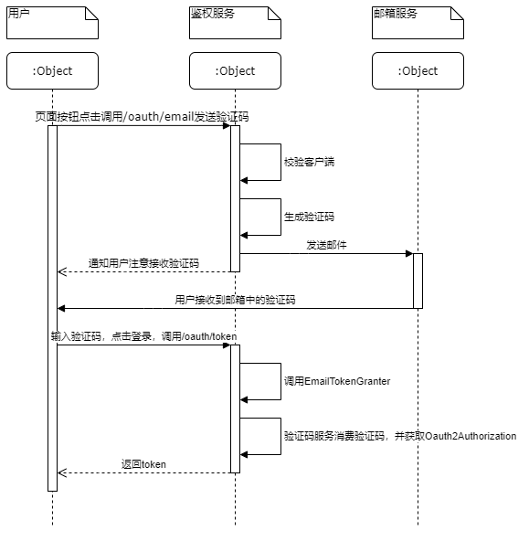

# 使用Nacos作为注册和配置中心

1. 添加依赖

```xml
<!--配置中心依赖-->
<dependency>
    <groupId>com.alibaba.cloud</groupId>
    <artifactId>spring-cloud-starter-alibaba-nacos-config</artifactId>
</dependency>
        <!--注册中心依赖-->
<dependency>
<groupId>com.alibaba.cloud</groupId>
<artifactId>spring-cloud-starter-alibaba-nacos-discovery</artifactId>
</dependency>
        </
```

2. 新建bootstrap.yml   
   有关nacos的配置必须在bootstrap.yml中,SpringCloud启动会首先读取bootstrap.yml中的数据

```yaml
# 必须配置,作为nacos配置中的配置的DataId前缀
spring:
  application:
    name: consumer
  cloud:
    nacos:
      # 注册中心地址
      discovery:
        server-addr: 127.0.0.1:8849
      # 配置中心地址
      config:
        server-addr: 127.0.0.1:8849
        # 配置中心的配置文件格式,默认properties
        file-extension: yaml
```

3. 在启动类上添加注解

```java
// 动态刷新配置文件数据
@RefreshScope
// 服务发现
@EnableDiscoveryClient
@SpringBootApplication
public class Application {

    public static void main(String[] args) {
        SpringApplication.run(Application.class, args);
    }
}
```

# 熔断器Hystrix

当调用其他微服务的接口时,接口发生报错则进行熔断,调用自定义的接口(此处使用Feign)   
使用FallbackFactory可以根据报错定义调用哪个熔断处理类,而fallback不管报什么错都会调用同一个处理方法

1. 添加Feign依赖

```xml

<dependency>
    <groupId>org.springframework.cloud</groupId>
    <artifactId>spring-cloud-starter-openfeign</artifactId>
</dependency>
```

2. 开启熔断器,feign.hystrix.enabled=true
3. 微服务接口

```java
public interface ProviderService {

    String getValue();

}
```

4. 熔断处理类

fallback

```java

@Component
public class ProviderServiceFallback implements ProviderService {
    @Override
    public String getValue() {
        log.warn("fallback");
        return "fallback";
    }
}
```

fallback factory

```java

@Component
public class ProviderServiceFallbackFactory implements FallbackFactory<ProviderService> {
    @Override
    public ProviderService create(Throwable throwable) {
        log.error("Call provider service error", throwable);
        return new ProviderService() {
            @Override
            public String getValue() {
                return "fallback factory ";
            }
        };
    }
}
```

5. 在微服务接口上添加熔断处理类

```java
// name是被调用的微服务名称,fallback是调用的微服务发生报错是调用的方法
@FeignClient(name = "provider", fallback = ProviderServiceFallback.class)
// fallback 和fallbackFactory 不可以同时使用
// @FeignClient(name = "provider", fallbackFactory = ProviderServiceFallbackFactory.class)
public interface ProviderService {
    //被调用的微服务接口地址
    @RequestMapping("/getvalue")
    String getValue();

}
```

# 集成OAuth 2.0

## 添加接口权限校验

对于类似Springboot中的接口权限校验功能，SpringCloud中可能需要添加额外的FilterSecurityInterceptor来实现

### AuthorizedResourceServerConfiguration

```java
@Configuration
public class WebSecurityConfig extends WebSecurityConfigurerAdapter {
	private final CustomizeAccessDecisionManager accessDecisionManager;
    private final CustomizeFilterInvocationSecurityMetadataSource securityMetadataSource;
    private final ResourceServerProperties resource;
    private final AuthenticationManager authenticationManager;
    public AuthorizedResourceServerConfiguration(CustomizeAccessDecisionManager accessDecisionManager, CustomizeFilterInvocationSecurityMetadataSource securityMetadataSource, ResourceServerProperties resource, AuthenticationManager authenticationManager) {
        this.accessDecisionManager = accessDecisionManager;
        this.securityMetadataSource = securityMetadataSource;
        this.resource = resource;
        this.authenticationManager = authenticationManager;
    }
    @Override
    public void configure(ResourceServerSecurityConfigurer resources) throws Exception {
        resources.resourceId(resource.getResourceId());
    }
    @Override
    public void configure(HttpSecurity http) throws Exception {
        ObjectPostProcessor customizeProcessor = new CustomizeObjectPostProcessor(accessDecisionManager, securityMetadataSource);
        http.authorizeRequests()
                .anyRequest()
                .authenticated()
                .and()
                .authorizeRequests()
                .withObjectPostProcessor(customizeProcessor)
                .and()
                // 取消Session,使用JWT
                .sessionManagement().sessionCreationPolicy(SessionCreationPolicy.STATELESS);
        OAuth2WebSecurityExpressionHandler oAuth2WebSecurityExpressionHandler = new OAuth2WebSecurityExpressionHandler();
        List> decisionVoters = new ArrayList<>();
        WebExpressionVoter expressionVoter = new WebExpressionVoter();
        expressionVoter.setExpressionHandler(oAuth2WebSecurityExpressionHandler);
        decisionVoters.add(expressionVoter);
        AffirmativeBased affirmativeBased = new AffirmativeBased(decisionVoters);
        LinkedHashMap> requestMap = new LinkedHashMap<>();
        requestMap.put(AnyRequestMatcher.INSTANCE, Collections.singletonList( () -> "authenticated"));
        ExpressionBasedFilterInvocationSecurityMetadataSource expressionBasedFilterInvocationSecurityMetadataSource = new ExpressionBasedFilterInvocationSecurityMetadataSource(requestMap, oAuth2WebSecurityExpressionHandler);
        FilterSecurityInterceptor securityInterceptor = new FilterSecurityInterceptor();
        securityInterceptor.setSecurityMetadataSource(expressionBasedFilterInvocationSecurityMetadataSource );
        securityInterceptor.setAccessDecisionManager(affirmativeBased);
        securityInterceptor.setAuthenticationManager(authenticationManager);
        securityInterceptor.afterPropertiesSet();
        securityInterceptor.setObserveOncePerRequest(false);
        http.addFilter(securityInterceptor);
    }
}
```


## 添加邮箱验证码登录（新增GrantType）

### 流程图



### EmailGrantType

```java
import org.springframework.security.core.Authentication;
import org.springframework.security.oauth2.common.exceptions.InvalidClientException;
import org.springframework.security.oauth2.common.exceptions.InvalidGrantException;
import org.springframework.security.oauth2.common.exceptions.InvalidRequestException;
import org.springframework.security.oauth2.provider.*;
import org.springframework.security.oauth2.provider.code.AuthorizationCodeServices;
import org.springframework.security.oauth2.provider.token.AbstractTokenGranter;
import org.springframework.security.oauth2.provider.token.AuthorizationServerTokenServices;

import java.util.HashMap;
import java.util.Map;

public class EmailTokenGranter extends AbstractTokenGranter {
    // grantType。比如：password、code等
    private static final String GRANT_TYPE = "email";

    // 验证码生成服务
    private final AuthorizationCodeServices authorizationCodeServices;

    /**
     * 
     * @param tokenServices token生成服务
     * @param clientDetailsService 客户端查询
     * @param requestFactory 请求工厂
     * @param authorizationCodeServices 验证码生成服务
     */
    public EmailTokenGranter(AuthorizationServerTokenServices tokenServices, ClientDetailsService clientDetailsService, OAuth2RequestFactory requestFactory, AuthorizationCodeServices authorizationCodeServices) {
        this(tokenServices, clientDetailsService, requestFactory, authorizationCodeServices, GRANT_TYPE);
    }

    protected EmailTokenGranter(AuthorizationServerTokenServices tokenServices, ClientDetailsService clientDetailsService, OAuth2RequestFactory requestFactory, AuthorizationCodeServices authorizationCodeServices, String grantType) {
        super(tokenServices, clientDetailsService, requestFactory, grantType);
        this.authorizationCodeServices = authorizationCodeServices;
    }

    /**
     * 调用/oauth/token，grantType等于 email时进入
     * 通过TokenRequest获取用户信息
     * @param client 客户端信息
     * @param tokenRequest token请求，会携带请求/oauth/token时的参数
     * @return 用户信息
     */
    @Override
    protected OAuth2Authentication getOAuth2Authentication(ClientDetails client, TokenRequest tokenRequest) {
        Map<String, String> parameters = tokenRequest.getRequestParameters();
        // 从请求参数中获取邮件发送的CODE
        String authorizationCode = parameters.get("code");
        if (authorizationCode == null) {
            throw new InvalidRequestException("An authorization code must be supplied.");
        }
        // 消费CODE并获取对应的Auth
        OAuth2Authentication storedAuth = this.authorizationCodeServices.consumeAuthorizationCode(authorizationCode);
        if (storedAuth == null) {
            throw new InvalidGrantException("Invalid authorization code: " + authorizationCode);
        }

        OAuth2Request pendingOAuth2Request = storedAuth.getOAuth2Request();
        String pendingClientId = pendingOAuth2Request.getClientId();
        String clientId = tokenRequest.getClientId();
        if (clientId != null && !clientId.equals(pendingClientId)) {
            throw new InvalidClientException("Client ID mismatch");
        }

        Map<String, String> combinedParameters = new HashMap<>(pendingOAuth2Request.getRequestParameters());
        combinedParameters.putAll(parameters);
        OAuth2Request finalStoredOAuth2Request = pendingOAuth2Request.createOAuth2Request(combinedParameters);
        Authentication userAuth = storedAuth.getUserAuthentication();
        return new OAuth2Authentication(finalStoredOAuth2Request, userAuth);
    }

}

```

### 发送验证码

```java
import org.springframework.beans.factory.annotation.Qualifier;
import org.springframework.security.authentication.UsernamePasswordAuthenticationToken;
import org.springframework.security.crypto.password.PasswordEncoder;
import org.springframework.security.oauth2.common.exceptions.BadClientCredentialsException;
import org.springframework.security.oauth2.common.exceptions.InvalidClientException;
import org.springframework.security.oauth2.provider.*;
import org.springframework.security.oauth2.provider.code.AuthorizationCodeServices;
import org.springframework.web.bind.annotation.RequestMapping;
import org.springframework.web.bind.annotation.RequestMethod;
import org.springframework.web.bind.annotation.RestController;

@RestController
public class EmailAuthorizationEndpoint {
    private final AuthorizationCodeServices authorizationCodeServices;

    private final PasswordEncoder passwordEncoder;

    private final ClientDetailsService clientDetailsService;

    private final OAuth2RequestFactory oAuth2RequestFactory;

    /**
     * 
     * @param authorizationCodeServices 验证码生成服务，和EmailTokenGranter中时同一个对象
     * @param passwordEncoder 密码加密器
     * @param clientDetailsService 客户端服务
     * @param oAuth2RequestFactory 请求工厂，和EmailTokenGranter中是同一个对象
     */
    public EmailAuthorizationEndpoint(@Qualifier("emailAuthorizationCodeServices") AuthorizationCodeServices authorizationCodeServices, PasswordEncoder passwordEncoder, ClientDetailsService clientDetailsService, OAuth2RequestFactory oAuth2RequestFactory) {
        this.authorizationCodeServices = authorizationCodeServices;
        this.passwordEncoder = passwordEncoder;
        this.clientDetailsService = clientDetailsService;
        this.oAuth2RequestFactory = oAuth2RequestFactory;
    }


    /**
     * 通过验证码生产服务生成验证码，并通过邮箱发送
     * @param parameters 请求参数，包含邮箱和客户端信息
     */
    @RequestMapping(value = "/oauth/email", method = RequestMethod.GET)
    public void oauthEmail(EmailAuthorizeParameters parameters) {
        if (parameters.getClientId() == null) {
            throw new InvalidClientException("A client id must be provided");
        }
        // 当前客户端
        ClientDetails client = this.clientDetailsService.loadClientByClientId(parameters.getClientId());
        if (client == null) {
            throw new InvalidClientException("invalid client");
        }
        if (!passwordEncoder.matches(parameters.getClientSecret(), client.getClientSecret())) {
            throw new BadClientCredentialsException();
        }

        if (parameters.getEmail() == null) {
            throw new RuntimeException("");
        }
        // 根据邮箱对应的用户信息，生成Oauth2Authentication
        UsernamePasswordAuthenticationToken authentication = new UsernamePasswordAuthenticationToken(parameters.getEmail(), "[PROTECTED]");
        AuthorizationRequest request = new AuthorizationRequest();
        request.setClientId(parameters.getClientId());
        request.setExtensions(parameters.getAuthorizationParameters());
        OAuth2Request storedOAuth2Request = this.oAuth2RequestFactory.createOAuth2Request(request);
        OAuth2Authentication combinedAuth = new OAuth2Authentication(storedOAuth2Request, authentication);

        // 根据Oauth2Authentication生成验证码
        String authorizationCode = authorizationCodeServices.createAuthorizationCode(combinedAuth);

        // 将验证码发送给对应的邮箱
        System.out.println("code：" + authorizationCode);
    }

}
```

### 发送验证码入参

```java
import java.io.Serializable;
import java.util.HashMap;
import java.util.Map;

public class EmailAuthorizeParameters {

    private String clientId;

    private String clientSecret;

    private String email;

    public Map<String, Serializable> getAuthorizationParameters() {
        HashMap<String, Serializable> authorizationParameters = new HashMap<>();
        authorizationParameters.put("clientId", clientId);
        authorizationParameters.put("clientSecret", clientSecret);
        authorizationParameters.put("email", email);
        return authorizationParameters;
    }

    public String getClientId() {
        return clientId;
    }

    public void setClientId(String clientId) {
        this.clientId = clientId;
    }

    public String getClientSecret() {
        return clientSecret;
    }

    public void setClientSecret(String clientSecret) {
        this.clientSecret = clientSecret;
    }

    public String getEmail() {
        return email;
    }

    public void setEmail(String email) {
        this.email = email;
    }
}
```

### Bean配置类

```java
package com.fool.config.security;

import org.springframework.context.annotation.Bean;
import org.springframework.context.annotation.Configuration;
import org.springframework.security.oauth2.provider.code.AuthorizationCodeServices;
import org.springframework.security.oauth2.provider.code.InMemoryAuthorizationCodeServices;

@Configuration
public class EmailAuthorizationBeanConfiguration {

	
    @Bean("emailAuthorizationCodeServices")
    public AuthorizationCodeServices authorizationCodeServices() {
        return new InMemoryAuthorizationCodeServices();
    }
    
    @Bean
    public OAuth2RequestFactory oAuth2RequestFactory(ClientDetailsService clientDetailsService) {
        return new DefaultOAuth2RequestFactory(clientDetailsService);
    }
}

```

### AuthorizationServerConfigurerAdapter

```java
import com.fool.config.security.EmailTokenGranter;
import com.fool.service.ClientService;
import org.springframework.beans.factory.annotation.Qualifier;
import org.springframework.context.annotation.Configuration;
import org.springframework.http.HttpMethod;
import org.springframework.security.authentication.AuthenticationManager;
import org.springframework.security.core.userdetails.UserDetailsService;
import org.springframework.security.jwt.crypto.sign.MacSigner;
import org.springframework.security.jwt.crypto.sign.RsaVerifier;
import org.springframework.security.oauth2.config.annotation.configurers.ClientDetailsServiceConfigurer;
import org.springframework.security.oauth2.config.annotation.web.configuration.AuthorizationServerConfigurerAdapter;
import org.springframework.security.oauth2.config.annotation.web.configuration.EnableAuthorizationServer;
import org.springframework.security.oauth2.config.annotation.web.configurers.AuthorizationServerEndpointsConfigurer;
import org.springframework.security.oauth2.config.annotation.web.configurers.AuthorizationServerSecurityConfigurer;
import org.springframework.security.oauth2.provider.ClientDetailsService;
import org.springframework.security.oauth2.provider.CompositeTokenGranter;
import org.springframework.security.oauth2.provider.OAuth2RequestFactory;
import org.springframework.security.oauth2.provider.TokenGranter;
import org.springframework.security.oauth2.provider.approval.InMemoryApprovalStore;
import org.springframework.security.oauth2.provider.client.ClientCredentialsTokenGranter;
import org.springframework.security.oauth2.provider.code.AuthorizationCodeServices;
import org.springframework.security.oauth2.provider.code.AuthorizationCodeTokenGranter;
import org.springframework.security.oauth2.provider.implicit.ImplicitTokenGranter;
import org.springframework.security.oauth2.provider.password.ResourceOwnerPasswordTokenGranter;
import org.springframework.security.oauth2.provider.refresh.RefreshTokenGranter;
import org.springframework.security.oauth2.provider.token.AuthorizationServerTokenServices;
import org.springframework.security.oauth2.provider.token.store.JwtAccessTokenConverter;
import sun.security.rsa.RSAPublicKeyImpl;

import java.nio.charset.StandardCharsets;
import java.security.InvalidKeyException;
import java.security.interfaces.RSAPublicKey;
import java.util.ArrayList;
import java.util.List;

@Configuration
@EnableAuthorizationServer
public class AuthorizationServerConfig extends AuthorizationServerConfigurerAdapter {

    private final ClientDetailsService clientDetailsService;

    private final UserDetailsService userDetailsService;

    private final AuthenticationManager authenticationManager;

    private final AuthorizationCodeServices authorizationCodeServices;

    private final AuthorizationCodeServices emailAuthorizationCodeServices;

    private final AuthorizationServerTokenServices authorizationServerTokenServices;

    private final OAuth2RequestFactory oAuth2RequestFactory;

    public AuthorizationServerConfig(ClientService clientDetailsService,
                                     UserDetailsService userDetailsService,
                                     AuthenticationManager authenticationManager,
                                     @Qualifier("codeAuthorizationCodeService") AuthorizationCodeServices authorizationCodeServices,
                                     @Qualifier("emailAuthorizationCodeServices") AuthorizationCodeServices emailAuthorizationCodeServices,
                                     AuthorizationServerTokenServices authorizationServerTokenServices, OAuth2RequestFactory oAuth2RequestFactory) {
        this.clientDetailsService = clientDetailsService;
        this.userDetailsService = userDetailsService;
        this.authenticationManager = authenticationManager;
        this.authorizationCodeServices = authorizationCodeServices;
        this.emailAuthorizationCodeServices = emailAuthorizationCodeServices;
        this.authorizationServerTokenServices = authorizationServerTokenServices;
        this.oAuth2RequestFactory = oAuth2RequestFactory;
    }

    @Override
    public void configure(AuthorizationServerSecurityConfigurer security) throws Exception {
        security.allowFormAuthenticationForClients()
                // 获取公钥接口（/oauth/token_key）是否需要认证
                .tokenKeyAccess("permitAll()")
                // 获取Token信息接口（/oauth/check_token）是否需要认证
                .checkTokenAccess("isAuthenticated()");
    }


    @Override
    public void configure(AuthorizationServerEndpointsConfigurer endpoints) throws Exception {
        endpoints.allowedTokenEndpointRequestMethods(HttpMethod.GET, HttpMethod.POST)
                .tokenServices(authorizationServerTokenServices)
                .authorizationCodeServices(authorizationCodeServices)
                // 此处的权限管理用于获取Token时的鉴定
                .authenticationManager(authenticationManager)
                .requestFactory(oAuth2RequestFactory)
                // 因为Oauth只能设置一个TokenGranter,所以使用了CompositeTokenGranter，这个会调用他所拥有的所有TokenGranter
                .tokenGranter(new CompositeTokenGranter(this.getDefaultTokenGranters()))
                .approvalStore(new InMemoryApprovalStore())
                .userDetailsService(userDetailsService);
    }


    
    private List<TokenGranter> getDefaultTokenGranters() {
        List<TokenGranter> tokenGranters = new ArrayList();
        tokenGranters.add(new AuthorizationCodeTokenGranter(authorizationServerTokenServices, authorizationCodeServices, clientDetailsService, oAuth2RequestFactory));
        tokenGranters.add(new RefreshTokenGranter(authorizationServerTokenServices, clientDetailsService, oAuth2RequestFactory));
        ImplicitTokenGranter implicit = new ImplicitTokenGranter(authorizationServerTokenServices, clientDetailsService, oAuth2RequestFactory);
        tokenGranters.add(implicit);
        tokenGranters.add(new ClientCredentialsTokenGranter(authorizationServerTokenServices, clientDetailsService, oAuth2RequestFactory));
        if (this.authenticationManager != null) {
            tokenGranters.add(new ResourceOwnerPasswordTokenGranter(this.authenticationManager, authorizationServerTokenServices, clientDetailsService, oAuth2RequestFactory));
        }

        tokenGranters.add(new EmailTokenGranter(authorizationServerTokenServices, clientDetailsService, oAuth2RequestFactory, emailAuthorizationCodeServices));

        return tokenGranters;
    }

    @Override
    public void configure(ClientDetailsServiceConfigurer clients) throws Exception {
        clients.withClientDetails(clientDetailsService);
    }

}

```

## 参考

https://www.cnblogs.com/ifme/p/12188982.html