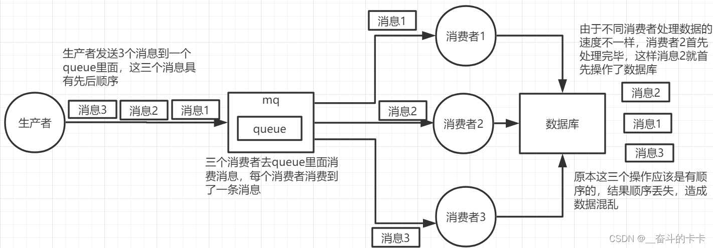
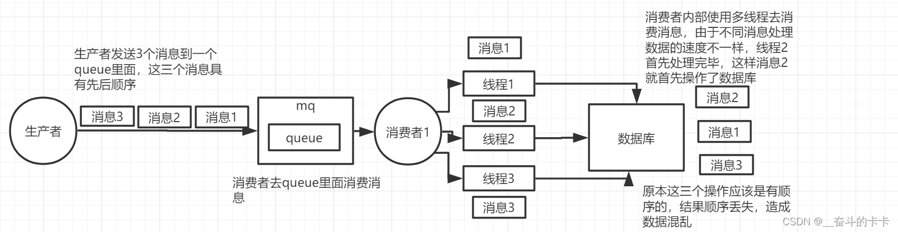
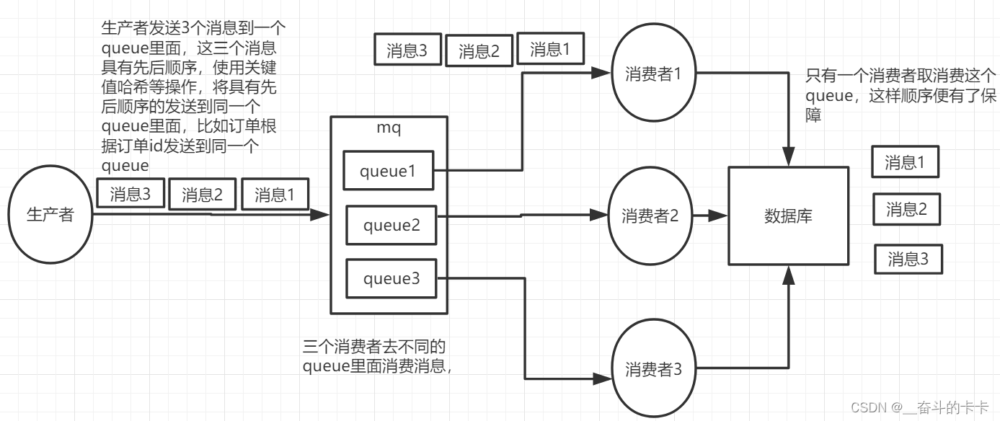
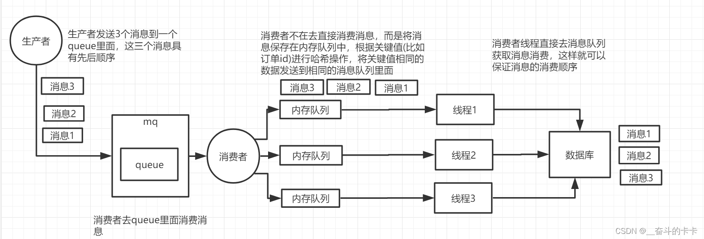

# Java

## HashMao1.7->1.8改动

1. 数据结构发生变动，1.7由数组+链表的形式组成，1.8由数据+链表/红黑树的形式组成
2. 1.7在扩容时数据采用尾插法，而1.8采用头插法
3. hash方法改动

## HashMap为什么线程不安全

1.7版本，多线程情况下，HashMap进行扩容时，先执行扩容的线程在执行扩容过程中因为线程挂起，导致后执行的线程先执行完毕扩容，导致出现环形链路或者数据丢失问题

1.8版本时，采用头插入，在没有Hash碰撞的情况下会直接插入数据，此时可能会出现数据覆盖问题

## HashMap中的hash方法为什么要右移16位并异或

为了让`hash`值的散列度更高，尽可能的去减少`hash`表的`hash`冲突，从而去提升数据的查找性能。

## 当百万数据存入HashMap中会发生什么事情

1. 如果计算机内存不足，可能会导致OutOfMemoryException（内存溢出）
2. 如果内存充足的情况下，因为HashMap是通过数组＋链表／红黑树实现，再百万存入数据过程中可能会发生大量的Hash冲突，导致链表变长，当超过８时，挂载在数组上的链表会转变成红黑树。

## 如何合理设置线程池参数

**线程数**

首先需要区分是CPU密集型还是IO密集型

**CPU密集型**通常设置的核心线程数为CPU核心数

**IO密集型**通常设置的核心线程数为`CPU 核心数 \* (1 + IO 耗时/ CPU 耗时)`，或者 `CPU 核心数 / (1 - 阻塞系数)`，或者`CPU核心数 * 2`

**混合型**设置公式：（（线程等待时间+线程CPU 时间） / 线程CPU 时间 ） * CPU 核数

混合型最大线程数

**队列大小**

队列大小一半设置为最大线程数的2倍


参考

[Java线程池如何合理配置核心线程数 - Vincent-yuan - 博客园](https://www.cnblogs.com/Vincent-yuan/p/16022613.html)

[阿里面试：5000qps访问一个500ms的接口，如何设计线程池的核心线程数、最大线程数？ 需要多少台机器？](https://mp.weixin.qq.com/s/JFWjDSQ4HRGbZhj9ei3t6Q)

## 如何设置线程池的队列长度大小

根据任务的平均时间和每秒的请求数来计算

$Size = (T * R)  /  (1 - P)$

平均执行时间：T

每秒请求数：R

期望线程池利用率：P

## JUC


## JVM

### 方法区内存溢出办法

在 Java 虚拟机（JVM）中，方法区用于存放类的元数据、常量池、静态变量等信息。当应用程序动态生成大量类或常量时，可能导致方法区内存溢出。要触发方法区内存溢出，可以通过以下方式：

1. **动态生成大量类：**
   - 使用字节码生成库（如 ASM、CGLib）或动态代理技术，在运行时生成大量类。
   - 例如，使用 CGLib 动态代理生成大量代理类，可能导致方法区内存溢出。
2. **频繁加载和卸载类：**
   - 在应用程序中频繁加载和卸载类，尤其是在类加载器未及时回收的情况下，可能导致方法区内存溢出。
   - 例如，使用自定义类加载器加载大量类，并且这些类未被及时卸载，可能导致方法区内存溢出。
3. **大量使用静态变量和常量：**
   - 在应用程序中定义大量的静态变量和常量，尤其是在类加载时初始化的常量，可能导致方法区内存溢出。
   - 例如，定义大量的静态常量，可能导致方法区内存溢出。

**注意事项：**

- 在 Java 8 及以上版本中，方法区被称为元空间（Metaspace），其内存不再受限于 JVM 参数 `-XX:MaxPermSize`，而是受限于本地内存。
- 在 Java 8 之前的版本中，方法区被称为永久代（PermGen），其内存大小可以通过 JVM 参数 `-XX:MaxPermSize` 进行设置。

**示例代码：**

以下是一个使用 CGLib 动态代理生成大量代理类的示例代码：

```java
import net.sf.cglib.proxy.Enhancer;

public class MethodAreaOOM {
    public static void main(String[] args) {
        while (true) {
            Enhancer enhancer = new Enhancer();
            enhancer.setSuperclass(Object.class);
            enhancer.setUseCache(false);
            enhancer.setCallback((obj, method, args1, proxy) -> null);
            enhancer.create();
        }
    }
}
```

运行上述代码可能导致方法区内存溢出。

**解决方法：**

- 减少动态生成类的数量，避免在运行时生成过多的类。
- 优化类加载和卸载机制，确保类加载器能够及时回收不再使用的类。
- 减少静态变量和常量的数量，避免在类加载时初始化过多的常量。

### 垃圾回收机制

**垃圾回收算法有哪些**

1. 标记-清除，首先通过可达性算法（根搜索）标记不可达对象，然后进行统一清除。性能高，但会有内存碎片，通常用于分代收集算法的老年代中
2. 标记-整理，首页也是通过可达性算法（根搜索）标记不可达对象，然后将所有可达对象向一端移动，然后将边界外的内存进行清除。效率不高，但不会有内存碎片，通常应用于分代收集算法的老年代中
3. 复制算法，将内存分为两块s0、s1，每次只使用其中一块内存区域，当内存区域s0使用完后，将其中的存活对象全部移动到另一块内存区域s1中去，并且清除s0。性能高，不会有内存碎片，但是可用内存大小减半，通常应用在对象存活周期短的年轻代中

**为什么使用分代收集算法**

可以针对不同年龄代的对象，使用合适的垃圾回收算法，年轻代中因为内存的频繁创建以及存活周期短，可以使用性能高且没有内存碎片的复制算法；而老年代的对象存活几率高，需要选择`标记-清除`、`标记-整理`算法

**参考**

[JVM之垃圾回收机制（GC）1. 简介垃圾回收 在做 Java 开发的过程中，我们会不断地创建很多的对象，这些对象数据会 - 掘金](https://juejin.cn/post/7123853933801373733)

[JVM垃圾回收详解（重点） | JavaGuide](https://javaguide.cn/java/jvm/jvm-garbage-collection.html#分代收集算法)

# 设计模式

## 单例模式

通过构造方法私有化，提供公共的实例获取方法实现

**实现方式:**

1. 懒汉模式，获取实例时进行判空。如果不加锁会有线程安全问题
2. 饥汉模式，私有变量直接赋值实例。JVM保证了线程安全
3. 双重检查模式，通过使用volatile，synchronized关键字来保证多线程下的线程安全问题
4. 静态内部类模式，由静态内部类持有实例，通过JVM加载外部类的过程中不会加载静态内部类的特性来保证线程安全
5. 枚举模式，枚举是天然的单例模式实现方式，完美解决所有可能存在的线程安全问题，但是不能延迟加载且占用内存高

# 网络

## TCP

### **三次握手**

1. 客户端发送连接请求
2. 服务端确认客户端连接请求，并向客户端发起请求连接
3. 客户端应答服务端发起的连接请求

### **四次挥手**

1. 客户端发送断开连接请求
2. 服务端确认断开连接请求
3. 服务端向客户端发送断开连接请求
4. 客户端确认服务端的断开连接请求

参考

[“三次握手，四次挥手”这么讲，保证你忘不了 - 三分恶 - 博客园](https://www.cnblogs.com/three-fighter/p/14802786.html)

### 粘包和拆包

**发生原因**

因为TCP是面向流的传输方式，所以是没有边界的，而操作系统在发送TCP数据时会通过缓冲区来进行优化，而缓冲区会有一个大小限制

如果单个请求的数据量没有达到缓冲区的大小限制，TCP会将多个请求进行合并发送，这就形成了粘包问题

如果单个请求的数据量超过了缓冲区的大小限制，TCP会将这个请求的数据拆分，然后进行多次发送，这就形成了拆包问题

**解决方案**

1. 定长数据包，将每个数据包的长度固定，如果不足的，可以通过补0等方式进行填充
2. 使用固定分隔符
3. 将消息分为头部和消息体，头部保存消息体的长度，以此来保证消息的完整性

netty中的解决方案

* `LineBaseFeameDecorder`以行为单位
* `DelimiterBaseFrameDecorder`使用分隔符
* `FixedLengthFrameDecorder`定长
* `LengthFieldBaseFrameDecorder`适用于消息头包含消息长度的协议

## Http

### http和https区别

1. https是在http基础上加上的数字签名功能,传输的内容由明文变成了密文
2. http比https的响应速度快，因为https需要首先向服务器请求签名证书
3. 使用的端口也不同，http使用80，https使用443

### https流程

https流程其实就是数字签名功能的流程

1. 客户端发送请求
2. 服务端响应请求，返回数字证书（包含公钥A）
3. 客户端验证证书，并获取公钥A
4. 客户端生成随机KEY，并使用服务端公钥A对随机KEY进行非对称加密
5. 客户端将加密后的随机码KEY发送给服务端
6. 服务端通过私钥B进行解密获取实际的随机码KEY
7. 服务器使用随机码KEY对传输内容进行数据的对称加密，并返回给客户端
8. 客户端使用之前生成的随机KEY进行内容解密

参考：

[HTTPS 详解一：附带最精美详尽的 HTTPS 原理图 - 个人文章 - SegmentFault 思否](https://segmentfault.com/a/1190000021494676)

# Spring

## 过滤器、拦截器、AOP区别与联系

过滤器：仅仅只是拦截请求，依赖于Servlet容器，通过Java的回调机制进行实现

拦截器：基于Java的反射机制实现

AOP：面向切面编程，可以通过JDK原生实现，不用依赖第三方，可以在调用方法的前后执行

## Spring Filter使用的什么模式

责任链模式

## Bean生命周期

# Mybatis

## 缓存机制

**一级缓存**

mybatis的一级缓存通过localCacheScope进行开启(默认开启)

```xml
<setting name="localCacheScope" value="SESSION"/>		
```

在同一个SqlSession中,如果使用相同条件查询(没有插入修改语句),mybatis只有在第一次回去查询数据库

```java
SqlSession sqlSession = sqlSessionFactory.openSession(true);
StudentMapper mapper = sqlSession.getMapper(StudentMapper.class);
System.out.println("first query");
mapper.selectByPrimaryKey(4L);
System.out.println("second query");
mapper.selectByPrimaryKey(4L);
System.out.println("third query");
mapper.selectByPrimaryKey(4L);
```

如果控制台打印了Sql语句,可以发现只有在first query后面打印了Sql语句

```
first query
2022-03-11 14:24:35.186  INFO 3796 --- [           main] com.zaxxer.hikari.HikariDataSource       : HikariPool-1 - Starting...
2022-03-11 14:24:36.145  INFO 3796 --- [           main] com.zaxxer.hikari.HikariDataSource       : HikariPool-1 - Start completed.
JDBC Connection [HikariProxyConnection@1841440668 wrapping com.mysql.cj.jdbc.ConnectionImpl@7d7b4e04] will not be managed by Spring
==>  Preparing: select id,name,age from student where id = ?
==> Parameters: 4(Long)
<==    Columns: id, name, age
<==        Row: 4, Rose, 15
<==      Total: 1
second query
third query

```

不过当遇到DML语句时,一级缓存就会失效

```java
SqlSession sqlSession = sqlSessionFactory.openSession(true);
StudentMapper mapper = sqlSession.getMapper(StudentMapper.class);

Student student = mapper.selectByPrimaryKey(4L);
System.out.println(student);
int i = mapper.insertStudent(buildStudent());
System.out.println("insert count:" + i);
mapper.selectByPrimaryKey(4L);
```

查询主键为4的学生后,向表中插入一条学生记录,再次查询主键为4的学生,这时mybatis会去查询数据库,而非使用缓存

```
==>  Preparing: select id,name,age from student where id = ?
==> Parameters: 4(Long)
<==    Columns: id, name, age
<==        Row: 4, Rose, 15
<==      Total: 1
Student(id=4, name=Rose, age=15)
==>  Preparing: insert into student(name, age) values (?, ?)
==> Parameters: df08c4aa-649c-4337-920f-ec68a89962fd(String), 23(Integer)
<==    Updates: 1
insert count:1
==>  Preparing: select id,name,age from student where id = ?
==> Parameters: 4(Long)
<==    Columns: id, name, age
<==        Row: 4, Rose, 15
<==      Total: 1
```

第二次查询会有SQL语句打印

mybatis的一级缓存的范围仅限于当前SqlSession,而且另一个SqlSession的DDL并不会使当前的SqlSession的缓存失效

```java
SqlSession sqlSession1 = sqlSessionFactory.openSession(true);
SqlSession sqlSession2 = sqlSessionFactory.openSession(true);

StudentMapper mapper1 = sqlSession1.getMapper(StudentMapper.class);
StudentMapper mapper2 = sqlSession2.getMapper(StudentMapper.class);

System.out.println(mapper1.selectByPrimaryKey(5L));
System.out.println(mapper2.selectByPrimaryKey(5L));

int jack = mapper1.updateStudentName("Jack", 5L);
System.out.println("mapper1 update count:" + jack);

System.out.println(mapper1.selectByPrimaryKey(5L));
System.out.println(mapper2.selectByPrimaryKey(5L));
```

2个SqlSession同时查询,其中一个修改了表数据,,第二次查询其中一个返回的时Jack另一个返回的应该时原数据,

> 注:Springboot使用autowired的mapper需要在方法上添加@Transactional,不然每次查询都会新创建一个SqlSession

```
==>  Preparing: select id,name,age from student where id = ?
==> Parameters: 5(Long)
<==    Columns: id, name, age
<==        Row: 5, Jack, 19
<==      Total: 1
Student(id=5, name=Jack, age=19)
JDBC Connection [HikariProxyConnection@436338687 wrapping com.mysql.cj.jdbc.ConnectionImpl@a99c42c] will not be managed by Spring
==>  Preparing: select id,name,age from student where id = ?
==> Parameters: 5(Long)
<==    Columns: id, name, age
<==        Row: 5, Jack, 19
<==      Total: 1
Student(id=5, name=Jack, age=19)
==>  Preparing: update student set name = ? where id =?
==> Parameters: Jhon(String), 5(Long)
<==    Updates: 1
mapper1 update count:1
==>  Preparing: select id,name,age from student where id = ?
==> Parameters: 5(Long)
<==    Columns: id, name, age
<==        Row: 5, Jhon, 19
<==      Total: 1
Student(id=5, name=Jhon, age=19)
Student(id=5, name=Jack, age=19)
```

**二级缓存**

二级缓存由多个SqlSessio共享,

启用二级缓存需要在配置文件中启用

```xml
<setting name="cacheEnabled" value="true"/>
```

然后再对应的映射xml中使用cache标签声明这个namespace使用二级缓存

```xml
<cache/>
```

想要二级缓存生效,SqlSession必须提交,

```java
SqlSession sqlSession1 = sqlSessionFactory.openSession(true);
SqlSession sqlSession2 = sqlSessionFactory.openSession(true);

StudentMapper mapper1 = sqlSession1.getMapper(StudentMapper.class);
StudentMapper mapper2 = sqlSession2.getMapper(StudentMapper.class);

Student student = mapper1.selectByPrimaryKey(4L);
System.out.println(student);
// 如果sqlSession1没有提交,mapper2的查询还是会走数据库
sqlSession1.commit();
Student student1 = mapper2.selectByPrimaryKey(4L);
System.out.println(student1);
```

二级缓存仍然会因为DDL语句而失效

```java
SqlSession sqlSession1 = sqlSessionFactory.openSession(true);
SqlSession sqlSession2 = sqlSessionFactory.openSession(true);
SqlSession sqlSession3 = sqlSessionFactory.openSession(true);

StudentMapper mapper1 = sqlSession1.getMapper(StudentMapper.class);
StudentMapper mapper2 = sqlSession2.getMapper(StudentMapper.class);
StudentMapper mapper3 = sqlSession3.getMapper(StudentMapper.class);

Student student = mapper1.selectByPrimaryKey(4L);
System.out.println(student);
sqlSession1.commit();

Student student1 = mapper2.selectByPrimaryKey(4L);
System.out.println(student1);

mapper3.updateStudentName("小明",4L);
sqlSession3.commit();

Student student2 = mapper2.selectByPrimaryKey(4L);
System.out.println(student2);

```

第二次查询走的缓存,第三次查询因为前面由DDL语句,则走的是数据库

```
JDBC Connection [@59320794 wrapping com.mysql.cj.jdbc.ConnectionImpl@69d667a5] will not be managed by Spring
==>  Preparing: select id,name,age from student where id = ?
==> Parameters: 4(Long)
<==    Columns: id, name, age
<==        Row: 4, Rose, 15
<==      Total: 1
Student(id=4, name=Rose, age=15)
As you are using functionality that deserializes object streams, it is recommended to define the JEP-290 serial filter. Please refer to https://docs.oracle.com/pls/topic/lookup?ctx=javase15&id=GUID-8296D8E8-2B93-4B9A-856E-0A65AF9B8C66
Cache Hit Ratio [com.fool.mybatiscache.mapper.StudentMapper]: 0.5
Student(id=4, name=Rose, age=15)
JDBC Connection [HikariProxyConnection@1111497601 wrapping com.mysql.cj.jdbc.ConnectionImpl@f1d1463] will not be managed by Spring
==>  Preparing: update student set name = ? where id =?
==> Parameters: 小明(String), 4(Long)
<==    Updates: 1
Cache Hit Ratio [com.fool.mybatiscache.mapper.StudentMapper]: 0.3333333333333333
JDBC Connection [HikariProxyConnection@1780974980 wrapping com.mysql.cj.jdbc.ConnectionImpl@28f90752] will not be managed by Spring
==>  Preparing: select id,name,age from student where id = ?
==> Parameters: 4(Long)
<==    Columns: id, name, age
<==        Row: 4, 小明, 15
<==      Total: 1
Student(id=4, name=小明, age=15)
```

因为二级缓存是根据namespace存储的,不同的namespace(相当于一个mapper.xml)之间不会因为DDL而互相影响,所以可能会导致一个namespace修改了数据,而另一个namespace的缓存没有更新,读取到了缓存中的脏数据

解决二级缓存可能读取到缓存中的脏数据问题,可以使用cache-ref标签引用其他namespace的缓存

```xml
<cache-ref namespace="mapper.StudentMapper"/>
```

引用其他namespace的缓存可能导致粒度变粗,多个namespace下的DDL操作都会对缓存造成影响

**参考资料：**

[聊聊MyBatis缓存机制 - 美团技术团队 (meituan.com)](https://tech.meituan.com/2018/01/19/mybatis-cache.html)

# ElasticSearch

[Elasticsearch-入门反向索引 - 知乎](https://zhuanlan.zhihu.com/p/341723054)

# 消息队列

## 原理

消息队列的本质是一个队列，而队列中存放的是一个个消息。队列是一个数据结构，具有先进先出的特点。消息队列则是将消息放到队列里，用队列做存储消息的介质。在消息队列中，消息的发送方称为生产者，消息的接收方称为消费者。生产者将消息发送到队列中，然后消费者从队列中取出消息进行处理。当消息被消费之后，它就从队列中删除。

消息队列提供了异步的通信协议，每一个队列中的记录包含详细说明的数据，包含发生的时间、输入设备的种类以及特定的输入参数。这意味着消息的发送者和接收者不需要同时与消息队列交互。消息会保存在队列中，直到接收者取回它。

下面通过一个简单的架构模型来解释消息队列的工作原理：

1. Producer（生产者）：负责产生和发送消息到 Broker（消息服务器）。生产者负责将消息发送到消息服务器（Broker）。
2. Broker（消息服务器）：消息处理中心。负责消息存储、确认、重试等，一般其中会包含多个 queue（队列）。Broker 是消息队列的核心部分，负责存储和管理消息。它通常包含多个队列，用于存储生产者发送的消息。
3. Consumer（消费者）：负责从 Broker 中获取消息，并进行相应处理。消费者从 Broker 中获取消息进行处理。消费者可以同时从多个队列中获取消息，也可以对获取的消息进行过滤和选择。
4. Topic（主题）：主题是一种将消息分类的方式，消费者可以根据主题订阅自己感兴趣的消息类型。
5. Queue（队列）：队列是保存消息的容器，生产者将消息发送到队列中，然后消费者从队列中取出消息进行处理。
6. Message（消息体）：消息体是实际的数据内容，包含了生产者发送给消费者的信息。

## RabbitMQ拒绝并重新入队的消息在队头还是队尾

队尾

## 消息确认超时，以及幂等解决方案

开启手动消息确认，并给每条消息设置唯一ID

因为消息队列没有明确的消费确认超时控制，需要消费端自行判断

Java端可以通过Future，Callable等异步方案来设置业务超时时间，如果超过未执行成功，则让该条消息重新入队

幂等性可以通过在缓存或者数据库中记录当前消息的状态，如果不是未执行过的则执行，否则跳过（不存在也跳过）

生产者在发送消息时，将缓存中当前消息的ID的值设置为未执行；当消费者获消息消息时判断缓存中的数据是否是未执行，如果不是则跳过该条消息；如果是则异步执行任务，并设置超时时间，如果规定时间内未执行完毕则拒绝消息并重新入队；当任务执行完毕后（不管是否超时），根据执行结果，如果成功则删除缓存数据，如果失败则不做处理

```java
public class MyMessageListener implements MessageListener {
    
	public void onMessage(Message message) {
        String messageId = message.getMessageId();
        
        if (checkRedisMessageExist(messageId)) {
            // 判断缓存中是否存在消息ID，不存在则跳过并且确认消息（需要在发送消息前将消息ID放入到缓存中）
            rejectMessage(message);
            return;
        }
        
        if (checkRedisMessageStatus(messageId)) {
            // 如果消息是执行状态，拒绝消息并重新入队
            return;
        }
        
        // 修改Redis消息ID对应的状态
        updateStatus(messageId);
        //处理业务逻辑
        try {
            boolean result = processBusinessLogic(message);
            // 正常晚上业务逻辑处理
            if (result) {
                // 业务成功，确认消息并将消息ID记录从Redis中删除
                acknowledgeMessage(message);
            } else {
                // 业务失败，拒绝消息并重新入队
                rejectMessage(message);
            }
        } catch (Exception e) {
            // 异常时（如业务处理超时）拒绝消息并重新入队
            rejectMessage(message);
        }
    }
    
    private boolean processBusinessLogic(Message message) {
        ExecutorService businessExecutor = Executors.newSingleThreadExecutor();
        Callable<Boolean> task = () -> {
            boolean result = ...;
            if(result){
                // 删除缓存
                deleteRedisCache(message.getMessageId());
            }
            return result;
        };

        Future<Boolean> future = businessExecutor.submit(task);
        // 如果超时会抛出 TimeoutException
        return future.get(timeout, TimeUnit.MILLISECONDS);   
    }

    private void acknowledgeMessage(Message message) {
        // 确认消息
        // channel.basicAck(message.getMessageProperties().getDeliveryTag(), false);
    }

    private void rejectMessage(Message message) {
        // 拒绝消息并重新入队
        // channel.basicNack(message.getMessageProperties().getDeliveryTag(), false, true);
    }
    
    // 修改状态
    private void updateStatus(String messageId){
        
    }
}
```


参考：

[RabbitMQ 消息确认超时：原因与解决方案-腾讯云开发者社区-腾讯云](https://cloud.tencent.com/developer/article/2311618)

## 如何保证消息的不丢失

消息的丢失可能存在于三个地方:

1. 消息生成发送到消息队列
2. 消息队列本身存储丢失
3. 消息队列将消息传递给消费者

为了确保消息成功发送到消息队列,在发送消息的时候会有个异步的回调函数,来获取由消息队列返回的ack,来表示消息队列接受到了消息

消息队列中的存储不丢失由消息中间件来保证

最后一步消息的消费,在消费者完成具体的业务逻辑后,返回消息确认的ack给消息队列

通过以上方法来保证消息的不丢失

## 如何保证消息的不重复消费

保证消息的不重复消费即需要实现消费消息的接口的幂等性

首先需要消息带有一个全局唯一的标识,在消费者端对全局唯一标识进行校验

在涉及到金钱等场景需要使用强校验,使用全局唯一标识去数据库表中查询是否存在记录,如果有就return,如果没有就执行业务逻辑,

在不重要的场景使用弱校验即可,将全局唯一标识存入redis缓存中,并设置失效时间,在一定时间内通过判断redis中是否存在来判断

## 消息积压情况如何处理

消息积压,说明消息产生速度远远大于消费的速度,所以问题是出现在消费者端

首先应急可以临时增加消费者端的数量,然后可以通过日志等判断等判断是需要进行代码优化提高消费速度,又或者进行消费者扩容

**预防措施**

通过设置队列的`x-message-ttl`来确保消息不会长时间留在队列中，并设置死信队列来接收并处理长时间未被消费的消息

1. 死信队列接收的消息可以临时存储到数据库进行持久化，后续通过定时任务等方式重新入队
2. 临时扩容机制，死信队列直接进行业务处理（相当于增加临时消费者）

参考：

[字节面试：如何解决MQ消息积压问题？-51CTO.COM](https://www.51cto.com/article/786805.html)

## 如何保证消费顺序

问题原因：

1. 生产这发送消息到消息队列后,有多个消费者对同一个队列进行消费,可能会导致消费顺序的错乱



2. 生产者发送消息到消息队列后,虽然只有一个消费者进行消费,但是这个消费者对消息进行多线程处理,也可能导致消息的错乱



**解决:**

**原因一解决方案:**

**解决方案一**

通过给队列添加参数 `x-single-active-consumer=true`来保证队列中只存在一个活动的消费者，这个消费者会接收并处理队列中的消息，而其他消费者虽然订阅了队列，但不会接收到任何消息，直到当前的活动消费者停止处理消息。当一个活动消费者停止（例如消费者连接断开或取消订阅），RabbitMQ 会 **自动** 将另一个消费者设为活动消费者，开始接收消息。

这种方法简单，但是处理效率不高

**解决方案二：**

根据消费者数量,来决定有多少个消息队列,并将消费者和消息队列进行一一绑定,生产者根据业务的唯一ID进行HASH操作后,发送到对应的消息队列,然后由对应的消费者消费,这样同一个业务下的消息都会由同一个消费者进行消费,这样就不会导致消费顺序错乱



这种方案需要对代码进行优化改动，但是效率比较高

**原因二解决方案:**

原因二消费顺序错乱的原因是单消费者,但使用了多线程,可以在消费者内部维护多个内存队列,同样也根据业务唯一ID的HASH值进行分发,然后由对应的线程去消费



> [RabbitMQ如何保证消息的顺序性【重点】-CSDN博客](https://blog.csdn.net/weixin_42039228/article/details/123526391)

# shardingsphere-jdbc

## 概念

- 逻辑表：水平拆分的数据库的相同逻辑和数据结构表的总称
- 真实表：在分片的数据库中真实存在的物理表。
- 数据节点：数据分片的最小单元。由数据源名称和数据表组成
- 绑定表：分片规则一致的主表和子表。
- 广播表：也叫公共表，指素有的分片数据源中都存在的表，表结构和表中的数据在每个数据库中都完全一致。例如字典表。
- 分片键：用于分片的数据库字段，是将数据库(表)进行水平拆分的关键字段。SQL中若没有分片字段，将会执行全路由，性能会很差。
- 分片算法：通过分片算法将数据进行分片，支持通过=、BETWEEN和IN分片。分片算法需要由应用开发者自行实现，可实现的灵活度非常高。
- 分片策略：真正用于进行分片操作的是分片键+分片算法，也就是分片策略。在ShardingJDBC中一般采用基于Groovy表达式的inline分片策略，通过一个包含分片键的算法表达式来制定分片策略，如t_user_$->{u_id%8}标识根据u_id模8，分成8张表，表名称为t_user_0到t_user_7。

## 分表分库原理

通过分片键的值，执行分片算法来计算数据应该路由到哪个表的哪个库

然后通过解析和改写SQL，将逻辑SQL转换成实际SQL

在执行完实际SQL后，将所有的实际SQL的执行结果进行聚合

分表分库因为实际涉及到多张表，所以也需要设计一个分布式主键，来保证全局有一个唯一的ID

# Mysql

## MySQL采用B+树作为索引的原因

1. 由于B+树的数据全都有序的以双向链表的方式存储在叶子中，在进行返回查找时效率高
2. 因为B+树非叶子节点不会存储数据，所以在同等条件下，B+树的非叶子节点可以存储更多的key（数据会占用空间），从而使得树的整体深度小，从根往下搜索的所需的IO次数比B树少

参考

[MySQL用B+树(而不是B树)做索引的原因 - ImreW - 博客园](https://www.cnblogs.com/imreW/p/17326796.html)

## 如何优化SQL

**SQL本身**

1. 避免使用select *；减少了查询的字段，减少了数据传输量，提高了IO效率；如果查询的字段包含在索引内，可以减少回表的操作
2. 避免使用子查询，使用join代替；使用子查询会产生一些临时表，会有性能损耗
3. 使用union/union all来代替or；or关键字可能会导致索引失效的情况产生

## 索引失效的情况

1. 当使用 like 时 % 在前面(e: name like '%Rose'),其他情况诸如在中间以及末尾索引都会生效(e:name like 'R%ose%')

2. 当使用or时可能会失效

   1. or 两边都是同一个表的条件时,两边的字段都是索引时,索引生效(e: s.name = 'rose' or s.age = 14,age 和 name都是索引);当其中一个不是索引的时候,两个字段的索引都不会生效(e: s.remark = '123' or s.name = 'rose', remark 不是索引, name是索引)
   2. or 两边不是同一个表的条件,并且时以join进行关联时,不管主表字段是否时索引字段,只要join表的字段是索引,那么join表的字段索引一定会被触发

3. 使用组合索引时,如果查询条件中没有带有索引第一个字段,则索引失效,

   ```sql
   create index test on student(name,age,sex);
   # 索引生效
   select * from student where name = 'rose' and age =11 and sex = 0;
   # 索引生效
   select * from student where name = 'rose' and sex = 0;
   # 索引未生效
   select * from student where name = 'rose' and age =11 and sex = 0;
   ```

4. 当索引字段冲突时,后面创建的索引失效

5. 当查询字段是varchar时,条件为数字时(e: name = 123, name是varchar),发生隐式转换,会导致索引失效,而当查询字段是数字,而条件是字符串时,索引仍旧为生效

   ```sql
   create index student_name on student(name);
   create index student_age on student(age);
   # 索引失效
   select * from student where name = 123;
   # 索引生效
   select * from student where age = '123';
   ```

6. 对字段进行操作,或者使用函数时索引失效(e: age + 1 = 10;left(name, 2) = 'rose')

7. 使用 !=, not 时索引可能失效,原因就是第八条:当全表扫描速度比索引速度快时，mysql会使用全表扫描，此时索引失效

8. 当全表扫描速度比索引速度快时，mysql会使用全表扫描，此时索引失效。

## 一条sql可以使用多少个索引

在 MySQL 中，一条 SQL 查询语句通常只能使用一个索引来执行。这意味着，尽管表上可能存在多个索引，但在执行查询时，MySQL 会选择一个最优的索引来执行该查询。然而，MySQL 也支持索引合并（Index Merge）优化策略，使得一条 SQL 查询可以同时使用多个索引。

**索引合并（Index Merge）：**

索引合并允许 MySQL 在执行查询时，结合多个索引的结果，以提高查询效率。具体而言，MySQL 可以对多个索引的结果进行并集、交集或并集与交集的组合操作。这种优化策略适用于以下情况：

- **并集（Union）：** 当查询条件涉及多个索引时，MySQL 可以使用多个索引的结果进行并集操作。
- **交集（Intersection）：** 当查询条件涉及多个索引，并且需要满足所有索引的条件时，MySQL 可以使用多个索引的结果进行交集操作。

需要注意的是，索引合并的使用取决于查询的具体条件和 MySQL 的查询优化器。在某些情况下，MySQL 可能会选择不使用索引合并，而是选择单一索引来执行查询。

**如何查看是否使用了索引合并：**

您可以使用 `EXPLAIN` 语句来查看查询的执行计划，从而判断是否使用了索引合并。如果在 `EXPLAIN` 的输出中，`type` 列显示为 `index_merge`，并且 `key` 列列出了多个索引名称，则表示查询使用了索引合并。

总之，虽然 MySQL 通常在一条 SQL 查询中使用一个索引，但在特定情况下，MySQL 可以通过索引合并策略，结合多个索引来优化查询性能。

## 模糊查询‘%’所在位置影响是否生效的原因

因为mysql的索引是通过b+树实现的，b+树会将数据顺序的存放在叶子节点中，并且mysql中非聚簇索引中的叶子节点只会存放索引列和主键，所以当模糊查询中，百分号不在查询条件的左侧时，就是说，查询条件的开头时固定的，比如``where name like 'value%'``,可以使用索引快速定位到查询条件的左侧开头的部分``value``，并且从索引中顺序读取后续的记录，因此这种情况下索引生效

# 数据库数据和缓存数据双写一致性解决办法

Redis、ES等缓存数据同步问题

## 同步双写

在将数据写入数据库的同时也写进缓存中

此方法仍旧会存在不一致问题

## 异步双写

使用队列进行异步同步，可以使用内存队列（BlockingQueue），或者消息队列（RabbitMQ）

在将数据写入数据库之后，将数据写入队列中，再由消费者线程异步将数据写入缓存中，通过由消费者的消息确认机制来保证数据的最终一致性

## 定期同步

数据的变动首先会写入数据库，然后有定时任务等方案，定期抽取有变动的数据，将这些数据写入缓存中

这种方案会受定时任务的执行时间间隔影响，导致数据会有一定的延迟

## 数据订阅

通过Canal等服务，伪装数据库的客户端，订阅数据库的binlog，Canal服务接收到binlog之后，将数据写入到消息队列中，由消费者消费binlog，将数据写入到缓存中

## ETL工具

使用databus、canal、otter、kettle等工具实现


**消息队列重试机制**

首先更新数据库，在将更新操作的数据放入消息队列中，由消费者操作更新操作，如果缓存操作失败，可以从消息队列中重新获取数据进行缓存更新，消息队列需要确保开启消息确认ACK机制

**通过Canal+消息队列重试机制**

在更新数据库后，通过Canal订阅数据库的binlog，将变动的数据放入到消息队列中，再由消费者对数据进行缓存更新

> ​	[淘宝太细了：mysql 和 es 的5个一致性方案，你知道吗？ - 疯狂创客圈 - 博客园](https://www.cnblogs.com/crazymakercircle/p/17445904.html)

# Redis

## 删除策略

1. 定时删除
2. 惰性删除，访问时会校验是否过期
3. 内存淘汰ce'lüe

## 内存淘汰策略

noeviction： 不淘汰任何key，但是内存满时不允许写入新数据但报错, 默认就是这种策略。

volatile-ttl： 对设置了TTL（过期时间）的key，比较key的剩余TTL值，TTL越小越先被淘汰

allkeys-random：对全体key ，随机进行淘汰。

volatile-random：对设置了TTL（过期时间）的key ，随机进行淘汰。

allkeys-lru： 对全体key，基于LRU算法进行淘汰

volatile-lru： 对设置了TTL（过期时间）的key，基于LRU算法进行淘汰

allkeys-lfu： 对全体key，基于LFU算法进行淘汰

volatile-lfu： 对设置了TTL的key，基于LFU算法进行淘汰

>**LRU（Least Recently Used）**最近最少使用。用当前时间减去最后一次访问时间，这个值越大则淘汰优先级越高。
>
>例如：key1是在3s之前访问的, key2是在9s之前访问的，删除的就是key2

>**LFU（Least Frequently Used）**最少频率使用。会统计每个key的访问频率，值越小淘汰优先级越高。
>
>例如：key1最近5s访问了4次, key2最近5s访问了9次， 删除的就是key1


## Redis击穿、穿透、雪崩以及解决方案

击穿、穿透、雪崩等情况都指的是在高并发的情况下

**击穿**
指的是高并发的情况下，单个Key在缓存中查询不到，去数据库查询的情况

解决方案：

1. 设置Value永不过期
2. 使用互斥锁（mutex key）

```java
public String get(key) {
      String value = redis.get(key);
      if (value == null) { //代表缓存值过期
          //设置3min的超时，防止del操作失败的时候，下次缓存过期一直不能load db
          if (redis.setnx(key_mutex, 1, 3 * 60) == 1) {  //代表设置成功
               value = db.get(key);
                      redis.set(key, value, expire_secs);
                      redis.del(key_mutex);

                     return value;
              } else {  //这个时候代表同时候的其他线程已经load db并回设到缓存了，这时候重试获取缓存值即可
                      sleep(10);
                      get(key);  //重试
              }
          } else {
              return value;      
          }

}
```

**雪崩**

雪崩值得是高并发的情况下，多个key查询缓存查询不到，去查询数据库，从而导致数据库压力增加

出现原因：多个Key同时失效或者redis宕机

解决方案：

1. reload机制，通过定时任务等方式，在Key失效前重新加载缓存，更新失效时间
2. 不同的key设置不同的失效时间，使雪崩的情况转换为击穿，并使用击穿的解决方案
3. 使用双缓存策略，分别设置短期、长期2个缓存，当短期缓存失效时，使用长期缓存

**击透**
在高并发的情况下，缓存和数据库中均不存在key所指定的缓存

解决方案：布隆过滤器

## 持久化方式

Redis的持久化方式有RDB和AOF两种方式

RDB持久化是把当前进程数据生成快照保存到磁盘上的过程，由于是某一时刻的快照，那么快照中的值要早于或者等于内存中的值。

RDB优点：

* RDB默认使用LZF算法进行压缩，压缩后的文件体积远远小于内存中的大小，适用于备份、全量复制等场景
* 使用RDB持久化方式，文件恢复要远远快于AOF方式

RDB缺点：

* 实时性不如AOF方式，对于短时间内的持久化比较薄弱
* RDB持久化后生成的文件是二进制的，没有可读性

AOF是将每次执行的命令记录保存，并且Redis采用的是先写内存，后写日志的方式

AOF优点：

* AOF默认保存指令的时间间隔是1秒，提供了数据更高的安全性，避免数据丢失

AOF缺点：

* 对于启动、恢复Redis数据比较慢（针对这个缺点，Redis提供了重写机制）

# 并发

## 幂等性

幂等性指的是在以相同参数重复调用的情况下，对系统产生的影响是一样的

### 幂等性的解决办法

1. 使用数据库主键来保证幂等性，不过需要生产一个全局唯一ID，适用于新增，删除操作
2. 通过添加版本字段来使用乐观锁保证更新的幂等性，每次数据更新都使版本往上自增
3. 使用一次性请求令牌来保证幂等性，每次在请求业务接口之前，先获取一个请求令牌，服务端生成令牌后存入redis，需要保证幂等性的业务接口需要每次校验请求令牌

参考

[一口气说出四种幂等性解决方案，面试官露出了姨母笑~ - 掘金 (juejin.cn)](https://juejin.cn/post/6906290538761158670#heading-19)

## 线程状态

线程状态分别有新键、可运行、阻塞（``Lock``，``synchronized``）、无限期等待（``Object.wait()``）、有限期等待（``Thread.sleep()``）、死亡

## 线程中断方式

1. 正常执行完毕
2. 通过调用``Thread.interrupt()``，来标记线程为中断状态，如果线程处于阻塞、等待（包含有限期与无限期）状态，那么就会抛出``InterruptedException``,如果不处于，那么线程不会中断，但是``interrupted()``方法会返回``true``
3.  线程池中的线程中断
   1. 中断整个线程池线程，调用``shutdownNow()``，相当于线程池中的所有线程都调用了``interrupt()``
   2. 中断线程池中的某个线程，线程池通过``submit()``方法提交一个线程后，会返回一个``Future<?>``对象，通过调用``cancel(true)``即可中断

# 微服务

## 服务划分依据

1. **业务领域划分：**
   - 根据业务功能和领域模型，将系统划分为多个服务，每个服务负责特定的业务功能或领域。
   - 例如，在电商系统中，可以将订单管理、支付处理、库存管理等功能划分为独立的服务。
   - 这种划分方式有助于实现业务的高内聚和低耦合。
2. **技术视角划分：**
   - 从技术角度出发，根据技术栈、数据库类型或其他技术特性进行服务划分。
   - 例如，使用不同数据库技术（如关系型数据库和NoSQL数据库）的模块可以划分为不同的服务。
   - 这种划分方式有助于技术的独立性和灵活性。
3. **业务流程和用户角色：**
   - 根据业务流程的不同阶段或用户角色的不同需求进行服务划分。
   - 例如，在客户关系管理系统中，可以根据获客、跟进、转化等流程阶段划分服务。
   - 这种划分方式有助于满足不同用户角色的需求。

# 分布式

## 分布式ID

### 号段模式

### 雪花ID

```java

public class SnowflakeIdGenerator {
    private static final long START_TIMESTAMP = 1640995200000L; // 自定义起始时间（2022-01-01 00:00:00）
    private static final long SEQUENCE_BITS = 12;
    private static final long MACHINE_BITS = 10;
    private static final long MAX_SEQUENCE = (1 << SEQUENCE_BITS) - 1;
    private static final long MAX_MACHINE_ID = (1 << MACHINE_BITS) - 1;

    private final long machineId;
    private long lastTimestamp = -1L;
    private long sequence = 0L;

    public SnowflakeIdGenerator(long machineId) {
        if (machineId > MAX_MACHINE_ID) {
            throw new IllegalArgumentException("Machine ID 超出范围");
        }
        this.machineId = machineId;
    }

    public synchronized long nextId() {
        long timestamp = System.currentTimeMillis();

        if (timestamp == lastTimestamp) {
            sequence = (sequence + 1) & MAX_SEQUENCE;
            if (sequence == 0) {
                // 4096 次用完，等待下一毫秒
                while ((timestamp = System.currentTimeMillis()) <= lastTimestamp) ;
            }
        } else {
            sequence = 0;
        }
        // 雪花ID组成
        // 符号位 时间戳                                      机器号       序列号（每毫秒可生成数）
        // 0     11000011010110110111101001100011001011010  0001100101  000000000001

        lastTimestamp = timestamp;
        // (timestamp - START_TIMESTAMP) << (SEQUENCE_BITS + MACHINE_BITS) 左移机器号位+序列号位，右边补零
        // machineId << SEQUENCE_BITS 左移序列号位，右边补零
        // 因为 0 和任意数A进行 或运算（|）都是其原本的值 1|0 = 1；0|0 = 0，完美的将时间戳、机器号、序列号组成在一起成一个数字
        return ((timestamp - START_TIMESTAMP) << (SEQUENCE_BITS + MACHINE_BITS))
                | (machineId << SEQUENCE_BITS)
                | sequence;
    }

    public static void main(String[] args) {
        SnowflakeIdGenerator generator = new SnowflakeIdGenerator(1);
        for (int i = 0; i < 10; i++) {
            System.out.println(generator.nextId());
        }
    }
}
```

**时钟回拨问题解决**

1. 预分配ID，提前生成好一定的ID，每次都中预生成的ID中取，发生时钟回拨时，继续从与生成中取，等待时间正常
2. 使用分布式时间同步，NTP（Network Time Protocol）

## 分布式锁业务超时怎么办

分布式锁（如Redisson）业务超时的情况，可以对锁进行续约

续约可以通过每隔一个固定时间执行一次的定时任务来检测，如果业务执行完毕则不做处理，如果未执行完毕，则进行续约

> 定时任务的间隔时间需要小于分布式锁的超时时间；业务的是否执行完毕的依据是判断分布式锁的key是否还存在；续约的操作是把相对应的分布式锁key的超时时间重新设置

分布式锁的value值也需要针对不同客户端进行设置，避免多个客户端冲突

参考：

[阿里二面：Redis分布式锁过期了但业务还没有执行完，怎么办-redis分布式锁过期了怎么办](https://www.51cto.com/article/679902.html)

## 在事务中使用分布式锁，该如何释放分布式锁

在 Spring 的事务管理中使用分布式锁（如 Redisson）时，需要注意锁的释放时机，以确保数据的一致性和完整性。

**问题描述：**

在使用 Spring 的 `@Transactional` 注解管理事务时，事务的提交或回滚是在方法执行完毕后由 Spring 容器自动处理的。如果在方法内部手动释放分布式锁（调用 `lock.unlock()`），可能会出现以下问题：

1. **锁提前释放：** 锁在事务提交前被释放，其他线程可能在当前事务提交前获取到锁，导致并发问题。
2. **数据不一致：** 由于锁的释放与事务提交的时机不一致，可能导致数据的不一致性。

**解决方案：**

1. **将锁的获取和释放放在事务的外层：**

   通过在事务方法外层再封装一层方法，在外层方法中获取和释放锁，确保锁的生命周期覆盖整个事务的执行过程。

   **示例代码：**

   ```java
   public void executeWithLock() {
       RLock lock = redissonClient.getLock("yourLockName");
       lock.lock();
       try {
           transactionalMethod();
       } finally {
           lock.unlock();
       }
   }
   
   
   public void transactionalMethod() {
       // 手动事务管理
   }
   ```

2. **使用自定义注解和 AOP 实现锁与事务的协调：**

   通过自定义注解和 AOP（面向切面编程），可以在方法执行前后自动获取和释放锁，并确保事务的提交与锁的释放顺序正确。

   **示例步骤：**

   - **定义自定义注解：**

     ```java
     @Target(ElementType.METHOD)
     @Retention(RetentionPolicy.RUNTIME)
     @Transactional
     public @interface RedissonLock {
         String lockName();
         long leaseTime() default 30;
         TimeUnit timeUnit() default TimeUnit.SECONDS;
     }
     ```

   - **实现 AOP 切面：**

     ```java
     @Aspect
     @Component
     public class RedissonLockAspect {
     
         @Autowired
         private RedissonClient redissonClient;
     
         @Around("@annotation(redissonLock)")
         public Object around(ProceedingJoinPoint joinPoint, RedissonLock redissonLock) throws Throwable {
             RLock lock = redissonClient.getLock(redissonLock.lockName());
             lock.lock(redissonLock.leaseTime(), redissonLock.timeUnit());
             try {
                 return joinPoint.proceed();
             } finally {
                 lock.unlock();
             }
         }
     }
     ```

   通过上述实现，方法在执行前会自动获取锁，执行完毕后自动释放锁，并且由于 `@Transactional` 注解的存在，事务的提交和回滚由 Spring 管理，确保锁的释放在事务提交之后。

# 锁

## 死锁产生的原因，如何解决，以及如何避免死锁

**死锁产生的条件：**

1. 互斥条件
2. 持有并等待
3. 不可剥夺
4. 环路等待

**互斥条件**

互斥条件指的是，多个线程不能同时使用同一个资源

**持有并等待条件**

持有并等待条件指的是线程A持有资源1又想申请资源2，而资源2已经被线程C持有，所以线程A就会处于等待状态，但是线程A在等待资源2的时候不会释放资源1

**不可剥夺条件**

不可剥夺条件指的是线程持有的资源在线程自身使用完释放前不能被其他线程获取

**环路等待条件**

环路等待条件值得时两个线程获取资源的混徐构成了环形链，比如线程A持有资源1，请求资源2，线程B持有资源2，请求资源1

**避免死锁发生的方法：**

1. 资源有序分配，线程A和线程B获取资源的顺序要保持一致，比如线程A先尝试获取资源1，再尝试获取资源2，线程B也要保持相同顺序
2. 给锁设置等待时间，超过等待时间，释放资源


## `synchronized` 和 `ReentrantLock` 的区别，如何选择

synchronized是java中的关键字，用于实现多线程下同步功能，ReentrantLock是java自带的api包中的类，也可以实现多线程下同步功能

多线程竞争时，synchronized不可以中断，而ReentrantLock可以调用中断方法或者根据等待时间进行中断，减少了出现死锁的可能性

synchronized是非公平锁，而ReentrantLock可根据不同的情形设置是否是公平锁

synchronized会根据线程竞争程度，从偏向锁，轻量级锁，重量级锁进行升级，到重量级锁时，会阻塞线程，ReentrantLock的核心类Sync实现了AQS，是通过自旋CAS操作实现同步功能，不会阻塞线程

通常情况下建议使用synchronized，如果有需要使用公平锁，中断等待等情形，建议使用ReentrantLock

## synchronized升级

锁升级的方向是无锁->偏向锁->轻量级锁->重量级锁

**无锁 -> 偏向锁**

当只有一个线程访问同步代码块时，会将线程地址放到对象头markword中，用于标记，此时已经升级为偏向锁，当同一个线程下次调用时只需简单判断markword中的地址是否是当前线程地址，即可直接调用。

**偏向锁->轻量级锁**

当有多个线程竞争，线程会在线程本地栈中生成LockRecord，使用CAS（自旋）去竞争对象的Markword的LockRecord指针，CAS成功的则获取轻量级锁，CAS失败的，会继续进行自旋

**轻量级锁->重量级锁**

在竞争轻量级锁中，CAS（自旋）达到一定次数后升级为重量级锁，此后进入竞争的线程会进入阻塞状态


